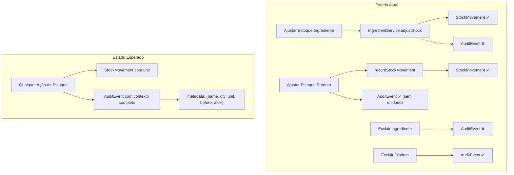

# 🔍 Relatório Técnico — Varredura de Estoque e Auditoria (Stockly)

> **Data:** 2026-03-13 | **Arquivos analisados:** 16 | **Problemas identificados:** 14

---

## 1. Mapeamento de Modelos (`schema.prisma`)

### 1.1 Campo `unit` (Unidade de Medida)

| Modelo | Campo `unit` | Tipo | Status |
|---|---|---|---|
| `Ingredient` | ✅ `unit UnitType` | Enum (`KG, G, L, ML, UN`) | OK |
| `Product` | ❌ **Ausente** | — | ⚠️ **Problema** |
| `AuditEvent` | ❌ **Ausente** | `metadata Json?` genérico | ⚠️ **Problema** |
| `StockMovement` | ❌ **Ausente** | — | ⚠️ **Problema** |

> [!CAUTION]
> `Product` não possui campo `unit`. O estoque de produtos é tratado como um `Int` (inteiro), sempre assumido como "UN" (unidades). Isso é hardcoded na UI e nunca persistido no banco de dados. Se no futuro existirem produtos vendidos por peso/volume, isso quebrará.

> [!WARNING]
> Nem `AuditEvent` nem `StockMovement` possuem um campo dedicado para unidade de medida. A informação de unidade **não é salva em nenhum dos dois registros de rastreabilidade**, tornando a auditoria "cega" para contexto de unidade.

---

## 2. Análise de Ações de Estoque — Comparativo

### 2.1 Tabela Comparativa: Ingredientes vs Produtos

| Aspecto | Ingredientes | Produtos | Inconsistência |
|---|---|---|---|
| **Ajuste de Estoque** | Via `IngredientService.adjustStock()` | Via `recordStockMovement()` inline + `AuditService` | ✅ Diferente engine |
| **Tipo StockMovement** | Sempre `MANUAL` | `ADJUSTMENT` | ⚠️ Tipos divergentes |
| **Precisão** | `Decimal` (aceita frações) | `Int` (somente inteiros) | ⚠️ Inconsistente |
| **Validação (schema)** | `z.number()` (float) | `z.number().int()` (inteiro) | ⚠️ Inconsistente |
| **Audit logging** | ❌ **Nenhum** | ✅ `AuditService.logWithTransaction` | 🔴 **Gap crítico** |
| **Subscription guard** | ❌ **Ausente** | ✅ `requireActiveSubscription` | ⚠️ Inconsistente |
| **Input step** | `step="any"` (decimais) | Sem `step` (inteiros) | Interface diferente |

### 2.2 Detalhes por Ação

#### Ajustar Estoque - Ingrediente
**Arquivo:** [index.ts](file:///c:/Projetos/stock-manager/app/_actions/ingredient/adjust-ingredient-stock/index.ts)

- Delega para `IngredientService.adjustStock()` que cria `StockMovement` com tipo `MANUAL`
- **Sem `AuditEvent.create()`** — não registra no log de auditoria
- **Sem `requireActiveSubscription()`** — permite ajuste sem assinatura ativa

#### Ajustar Estoque - Produto
**Arquivo:** [index.ts](file:///c:/Projetos/stock-manager/app/_actions/product/adjust-stock/index.ts)

- Usa `recordStockMovement()` com tipo `ADJUSTMENT` + `AuditService.logWithTransaction` dentro de transação
- ✅ Possui `requireActiveSubscription()`
- ⚠️ O `metadata` enviado para auditoria é: `{ productId, quantity, reason }` — **sem unidade**

---

## 3. Rastreamento de Auditoria — Gap Analysis

### 3.1 Matriz de Cobertura de Audit Logging

| Ação | Ingrediente | Produto |
|---|---|---|
| **Criar** | ❌ Sem audit | ✅ `PRODUCT_CREATED` |
| **Editar (metadados)** | ❌ Sem audit | ✅ `PRODUCT_UPDATED` |
| **Excluir (soft delete)** | ❌ Sem audit | ✅ `PRODUCT_DELETED` |
| **Ajustar Estoque** | ❌ Sem audit | ✅ `STOCK_ADJUSTED` |

> [!CAUTION]
> **100% das ações de Ingrediente estão sem registro de auditoria.** Nenhuma operação CRUD de ingrediente gera um `AuditEvent`. Isso significa que alterações em insumos são completamente invisíveis no log de auditoria em `settings/audit`.

### 3.2 Enum `AuditEventType` — Tipos Inexistentes

O enum `AuditEventType` no schema **não possui** nenhum tipo para ingredientes:

```diff
  enum AuditEventType {
    // ... tipos existentes ...
    STOCK_ADJUSTED
    PRODUCT_CREATED
    PRODUCT_UPDATED
    PRODUCT_DELETED
+   INGREDIENT_CREATED    // ❌ Não existe
+   INGREDIENT_UPDATED    // ❌ Não existe
+   INGREDIENT_DELETED    // ❌ Não existe
+   INGREDIENT_STOCK_ADJUSTED  // ❌ Não existe
  }
```

### 3.3 Payload de Auditoria — Análise de Contexto

| Ação | O que é salvo no `metadata` | O que deveria ser salvo |
|---|---|---|
| `adjustStock` (Produto) | `{ productId, quantity, reason }` | `{ productId, name, quantity, unit, stockBefore, stockAfter, reason }` |
| `upsertProduct` (Criar) | `{ productId, sku, name }` | `+ price, cost, stock, type` |
| `upsertProduct` (Editar) | `{ productId, sku, name }` | `+ changedFields, oldValues, newValues` |
| `deleteProduct` | `{ productId, name, reason }` | ✅ Aceitável |
| Todos de Ingrediente | **N/A (não existe)** | Todos os campos relevantes + `unit` |

> [!IMPORTANT]
> O payload de auditoria na ação `adjustStock` salva apenas `quantity: 10` mas **nunca salva a unidade**. Quando o administrador olha o log, ele vê "alterou manualmente o estoque de um produto" sem saber se foram 10 **kg**, 10 **unidades** ou 10 **litros**.

---

## 4. Interface de Auditoria — Análise de UI

### 4.1 Página de Movimentações (`/audit`)

**Arquivo:** [page.tsx](file:///c:/Projetos/stock-manager/app/(protected)/audit/page.tsx)
**Colunas:** [table-columns.tsx](file:///c:/Projetos/stock-manager/app/(protected)/audit/_components/table-columns.tsx)
**Data access:** [get-stock-movements.ts](file:///c:/Projetos/stock-manager/app/_data-access/stock-movement/get-stock-movements.ts)

**Problema na coluna "Qtd."** (linhas 70-81 de `table-columns.tsx`):

```tsx
// ATUAL — Renderiza apenas o número sem unidade
{isNegative ? "" : "+"}
{movement.quantity}
// Exibe: "+10" ou "-5"

// DEVERIA — Concatenar com a unidade do item
{isNegative ? "" : "+"}
{movement.quantity} {movement.unit}
// Exibir: "+10 kg" ou "-5 UN"
```

**Causa raiz:** O `StockMovementDto` e a query em `getStockMovements` **não buscam o campo `unit` do ingrediente**, nem existe `unit` no `Product`:

```typescript
// get-stock-movements.ts - linhas 63-68
ingredient: {
  select: {
    name: true,
    // ❌ Falta: unit: true
  },
},
```

### 4.2 Página de Auditoria (`/settings/audit`)

**Arquivo:** [page.tsx](file:///c:/Projetos/stock-manager/app/(protected)/settings/audit/page.tsx)
**Mapper:** [audit-mapper.tsx](file:///c:/Projetos/stock-manager/app/_services/audit-mapper.tsx)

**Problema no `AuditMapper` para `STOCK_ADJUSTED`** (linhas 79-85):

```tsx
// ATUAL — Descrição genérica sem detalhes
case AuditEventType.STOCK_ADJUSTED:
  return {
    title: "Ajuste de estoque",
    description: `${actor} alterou manualmente o estoque de um produto.`,
    // ❌ Não mostra: nome do item, quantidade, unidade, antes/depois
  };
```

> [!WARNING]
> O AuditMapper para `STOCK_ADJUSTED` ignora completamente o `metadata` disponível. Mesmo que o payload contenha `{ quantity, reason }`, a descrição renderizada é estática e genérica.

### 4.3 Diferenças nos Modais de Ajuste de Estoque

| Aspecto | Ingrediente (`adjust-stock-dialog-content.tsx`) | Produto (`adjust-stock-dialog-content.tsx`) |
|---|---|---|
| **Prop `unitLabel`** | ✅ Recebe e exibe `unitLabel` dinâmico | ❌ Hardcoded `"UN"` |
| **Input step** | `step="any"` (aceita decimais 0.5, 1.25) | Sem `step` (inteiros via `parseInt`) |
| **`formatQuantity` call** | `formatQuantity(stock, unitLabel)` | `formatQuantity(stock, "UN")` |
| **Preview de novo estoque** | ✅ Com unidade dinâmica | ❌ Sempre "UN" |

---

## 5. Problema de Precisão no `IngredientService`

**Arquivo:** [ingredient.ts](file:///c:/Projetos/stock-manager/app/_services/ingredient.ts) — linhas 58-59

```typescript
// ⚠️ Math.round perde precisão decimal!
stockBefore: Math.round(stockBefore),
stockAfter: Math.round(stockAfter),
```

> [!WARNING]
> O `IngredientService.adjustStock` usa `Math.round()` no `stockBefore` e `stockAfter` antes de salvar no `StockMovement`. Para ingredientes medidos em `KG` ou `L`, um estoque de `2.5 kg` será registrado como `3 kg` no histórico de movimentação. Isso corrompe a rastreabilidade de precisão.

Enquanto isso, o `recordStockMovement` (usado por produtos) salva o valor Decimal diretamente, sem arredondamento.

---

## 6. Resumo dos Arquivos que Precisam de Refatoração

### 🔴 Prioridade Crítica (Audit Cego)

| # | Arquivo | Problema |
|---|---|---|
| 1 | [schema.prisma](file:///c:/Projetos/stock-manager/prisma/schema.prisma) | Adicionar tipos `INGREDIENT_*` ao enum `AuditEventType` |
| 2 | [adjust-ingredient-stock/index.ts](file:///c:/Projetos/stock-manager/app/_actions/ingredient/adjust-ingredient-stock/index.ts) | Adicionar `AuditService.logWithTransaction` + `requireActiveSubscription` |
| 3 | [upsert-ingredient/index.ts](file:///c:/Projetos/stock-manager/app/_actions/ingredient/upsert-ingredient/index.ts) | Adicionar audit logging para criar/editar ingrediente |
| 4 | [delete-ingredient/index.ts](file:///c:/Projetos/stock-manager/app/_actions/ingredient/delete-ingredient/index.ts) | Adicionar audit logging para exclusão de ingrediente |

### 🟡 Prioridade Alta (Dados Incompletos)

| # | Arquivo | Problema |
|---|---|---|
| 5 | [adjust-stock/index.ts](file:///c:/Projetos/stock-manager/app/_actions/product/adjust-stock/index.ts) (produto) | Enriquecer `metadata` com `name`, `unit`, `stockBefore`, `stockAfter` |
| 6 | [upsert-product/index.ts](file:///c:/Projetos/stock-manager/app/_actions/product/upsert-product/index.ts) | Enriquecer `metadata` com mais contexto (price, cost, changedFields) |
| 7 | [ingredient.ts](file:///c:/Projetos/stock-manager/app/_services/ingredient.ts) | Remover `Math.round()` nas linhas 58-59 para preservar precisão |
| 8 | [get-stock-movements.ts](file:///c:/Projetos/stock-manager/app/_data-access/stock-movement/get-stock-movements.ts) | Adicionar `unit: true` no select de `ingredient` |

### 🟢 Prioridade Média (UI / UX)

| # | Arquivo | Problema |
|---|---|---|
| 9 | [table-columns.tsx](file:///c:/Projetos/stock-manager/app/(protected)/audit/_components/table-columns.tsx) | Concatenar unidade na coluna "Qtd." |
| 10 | [audit-mapper.tsx](file:///c:/Projetos/stock-manager/app/_services/audit-mapper.tsx) | Usar `metadata` para enriquecer descrição de `STOCK_ADJUSTED` + adicionar mappings de `INGREDIENT_*` |
| 11 | [adjust-stock-dialog-content.tsx](file:///c:/Projetos/stock-manager/app/(protected)/products/_components/adjust-stock-dialog-content.tsx) (produto) | Substituir `"UN"` hardcoded por prop dinâmica (quando `Product.unit` existir) |
| 12 | [adjust-stock/schema.ts](file:///c:/Projetos/stock-manager/app/_actions/product/adjust-stock/schema.ts) | Avaliar se `z.number().int()` é correto ou se deveria aceitar decimais |

---

## 7. Diagrama de Fluxo — Estado Atual vs Esperado



---

> **Conclusão:** O módulo de Ingredientes opera em um "modo legado" sem nenhuma integração com o sistema de auditoria, enquanto Produtos foram parcialmente integrados mas com metadata insuficiente. A raiz do problema está na ausência do campo `unit` no modelo `Product` e na ausência de event types para ingredientes no enum `AuditEventType`. 
