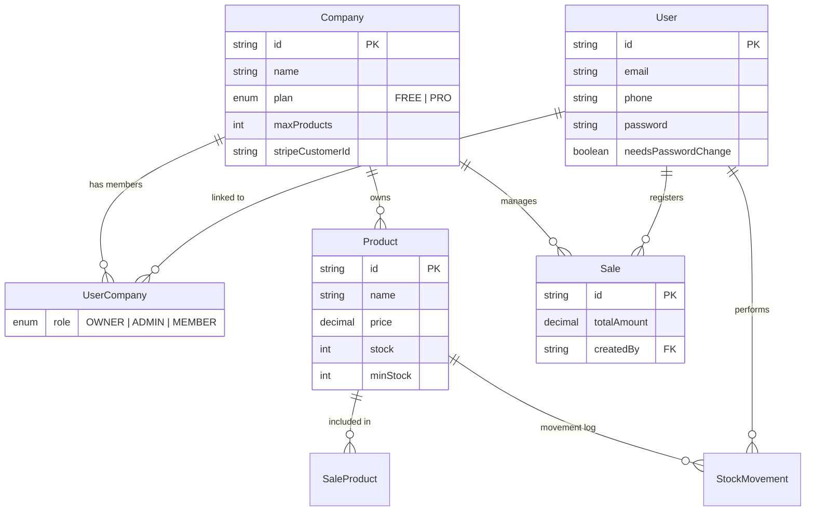

# 📦 STOCKY

> **A modern, enterprise-ready inventory management system designed for multi-tenant scalability and precision.**

[](https://nextjs.org/)
[](https://reactjs.org/)
[](https://www.typescriptlang.org/)
[](https://www.prisma.io/)
[](https://tailwindcss.com/)
[](https://stripe.com/)
[](https://sentry.io/)

## 🎯 **Project Overview**

STOCKY is a robust multi-tenant SaaS solution. It enables business owners to manage inventory across multiple companies, coordinate teams with granular permissions, and gain deep financial insights through advanced analytics—all while scaling effortlessly with Stripe-powered subscriptions.

### ✨ **Core SaaS Pillars**

- **🏢 Advanced Multi-tenancy**: Complete data isolation across companies. A single user can be part of multiple organizations with different roles.
- **👥 Identity & Team Management**: Professional role hierarchy (**Owner**, **Admin**, **Member**). Includes a frictionless **WhatsApp invitation flow** and mandatory password resets for new members.
- **📈 Professional Analytics**: Growth engines that track revenue, cost, profit, and margin trends. Dynamic period filters (Today, 7D, 30D, Monthly) with interactive charts.
- **💳 Enterprise Billing**: Full Stripe integration with Pro plans, usage-based limitations, and self-service Customer Portal access.
- **🛡️ Audit & Security**: Transactional stock movements, sales linked to specific users (Audit Trail), and encrypted credential management.

## 🚀 **Tech Stack**

### **The Engine**

| Technology     | Role        | Features                                                   |
| :------------- | :---------- | :--------------------------------------------------------- |
| **Next.js 14** | Foundation  | App Router, Server Actions, Streaming & Parallel Routes    |
| **Auth.js v5** | Security    | Type-safe authentication & session management              |
| **Prisma ORM** | Data        | PostgreSQL integration with multi-tenant relational schema |
| **Stripe**     | Revenue     | Automated billing, webhooks, and subscription lifecycle    |
| **Sentry**     | Reliability | Full-stack error monitoring and performance tracing        |

### **The Experience**

| Library          | Description                                     |
| :--------------- | :---------------------------------------------- |
| **Tailwind CSS** | Premium glassmorphism and modern UI tokens      |
| **shadcn/ui**    | Robust components powered by Radix UI           |
| **Recharts**     | Dynamic financial data visualization            |
| **Sonner**       | Interactive, non-blocking user notifications    |
| **Zod**          | End-to-end schema validation for server actions |

## 📊 **Relational Architecture**



## 🛠️ **Installation & Features**

### **1. Rapid Deployment**

```bash
git clone https://github.com/tonelopes-dev/stock-manager
npm install
npx prisma generate
```

### **2. Advanced Features**

- **Smart Exports**: Generate professional CSV reports for products and sales with calculated financial metrics.
- **Low Stock Alerts**: Real-time dashboard indicators when items fall below their `minStock` threshold.
- **WhatsApp Onboarding**: Invite members by generating a temporary access link sent directly via WhatsApp.
- **Onboarding Guard**: Mandatory step-by-step setup for new companies to ensure data integrity.

## 📁 **Project Structure**

```bash
stocky/
├── app/
│   ├── (protected)/        # Dashboard, Team, Profile, Products, Sales
│   ├── auth/               # Login, Forgot Password, Reset Password
│   ├── _actions/           # Transactional Server Actions (User, Sale, Product)
│   ├── _data-access/       # Repository Pattern for clean data fetching
│   └── _lib/               # Core configs (Auth, RBAC, Prisma, Stripe)
├── prisma/                 # Relational Multi-tenant Schema
└── package.json            # Scripts for Dev and Stripe Local Listeners
```

---

<div align="center">

**STOCKY - Empowering Modern Inventory Management**

[🌐 Production Access](https://stocky-360.vercel.app/) • [🛠️ Issues](https://github.com/tonelopes-dev/stock-manager/issues)

</div>
