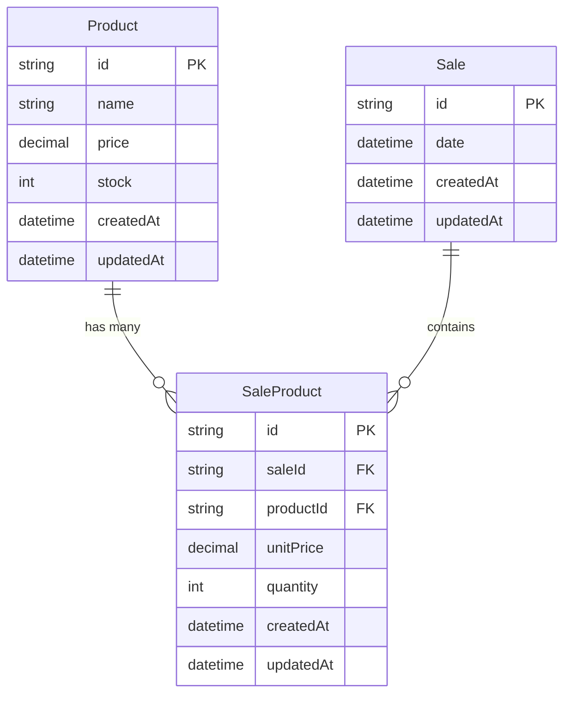

# 📦 STOCKLY

> **A modern inventory management system designed to help small and medium-sized businesses organize their stock efficiently.**

[](https://nextjs.org/)
[](https://reactjs.org/)
[](https://www.typescriptlang.org/)
[](https://www.prisma.io/)
[](https://tailwindcss.com/)

## 🎯 **Project Overview**

STOCKLY is a comprehensive inventory management solution built specifically for small and medium-sized enterprises (SMEs). Our mission is to simplify stock organization, streamline product management, and provide valuable insights to help businesses grow efficiently.

### ✨ **Key Features**

- **📋 Product Management**: Complete CRUD operations for inventory items
- **📊 Real-time Stock Tracking**: Monitor inventory levels with automatic status updates
- **💰 Price Management**: Track unit prices and manage product costs
- **🔍 Advanced Filtering**: Search and filter products by various criteria
- **📱 Responsive Design**: Mobile-first approach for on-the-go management
- **🎨 Modern UI**: Clean, intuitive interface built with shadcn/ui components
- **⚡ Fast Performance**: Optimized with Next.js 15 App Router
- **🔒 Type-Safe**: Full TypeScript implementation for reliability

## 🚀 **Tech Stack**

### **Frontend**

- **Next.js 15.5.4** - React framework with App Router
- **React 19.2.0** - Latest React with concurrent features
- **TypeScript 5.7.3** - Type-safe development
- **Tailwind CSS 3.4.18** - Utility-first CSS framework
- **shadcn/ui** - Modern React component library
- **Radix UI** - Accessible, unstyled UI primitives
- **Lucide React** - Beautiful & consistent icon library

### **Backend & Database**

- **Prisma 6.4.1** - Next-generation ORM
- **PostgreSQL** - Robust relational database (Neon Cloud)
- **Zod 4.1.11** - Schema validation library

### **Development Tools**

- **ESLint 8.57.1** - Code linting and formatting
- **Prettier 3.5.2** - Code formatting
- **React Hook Form 7.54.2** - Performant forms with validation

## 🛠️ **Installation & Setup**

### **Prerequisites**

- Node.js 18+
- npm or yarn
- PostgreSQL database (or use provided Neon connection)

### **Getting Started**

1. **Clone the repository**

   ```bash
   git clone https://github.com/tonelopes-dev/stockly.git
   cd stockly
   ```

2. **Install dependencies**

   ```bash
   npm install
   ```

3. **Environment Setup**

   ```bash
   cp .env.example .env
   ```

   Update your `.env` file with your database credentials:

   ```env
   DATABASE_URL="your_postgresql_connection_string"
   ```

4. **Database Setup**

   ```bash
   # Generate Prisma client
   npx prisma generate

   # Run database migrations
   npx prisma migrate deploy
   ```

5. **Start Development Server**

   ```bash
   npm run dev
   ```

   Open [http://localhost:3000](http://localhost:3000) in your browser.

## 📊 **Database Schema**



## 🎨 **Features in Detail**

### **Product Management**

- ✅ Add new products with name, price, and stock quantity
- ✅ Edit existing product information
- ✅ Delete products with confirmation dialog
- ✅ Automatic stock status calculation (In Stock / Out of Stock)
- ✅ Real-time price formatting and validation

### **User Interface**

- ✅ Responsive data tables with sorting and filtering
- ✅ Modal dialogs for product creation/editing
- ✅ Toast notifications for user feedback
- ✅ Dark/Light theme support with next-themes
- ✅ Accessible components following WCAG guidelines

### **Data Management**

- ✅ Form validation with Zod schemas
- ✅ Server actions for secure data mutations
- ✅ Optimistic UI updates for better UX
- ✅ Error handling and loading states

## 🚧 **Development Status**

**Current Phase**: 🔨 **Active Development**

### **Completed Features** ✅

- [x] Project setup and configuration
- [x] Database schema design
- [x] Product CRUD operations
- [x] Responsive UI components
- [x] Form validation and error handling
- [x] Real-time stock status tracking

### **In Progress** 🚧

- [ ] Sales management system
- [ ] Dashboard with analytics
- [ ] Advanced reporting features
- [ ] Bulk product operations
- [ ] Data export functionality

### **Planned Features** 📋

- [ ] User authentication and authorization
- [ ] Multi-store support
- [ ] Inventory alerts and notifications
- [ ] Mobile app (React Native)
- [ ] API documentation
- [ ] Advanced analytics and insights

## 🧪 **Available Scripts**

```bash
# Development
npm run dev          # Start development server
npm run build        # Build for production
npm run start        # Start production server

# Database
npm run prisma:generate    # Generate Prisma client
npx prisma migrate dev     # Run database migrations
npx prisma studio         # Open Prisma Studio

# Code Quality
npm run lint         # Run ESLint
npm run type-check   # Check TypeScript types
```

## 🤝 **Contributing**

We welcome contributions from the community! This project aims to help small and medium businesses, and your contributions can make a real impact.

### **How to Contribute**

1. Fork the repository
2. Create a feature branch (`git checkout -b feature/amazing-feature`)
3. Commit your changes (`git commit -m 'Add some amazing feature'`)
4. Push to the branch (`git push origin feature/amazing-feature`)
5. Open a Pull Request

### **Development Guidelines**

- Follow the existing code style and conventions
- Add TypeScript types for all new code
- Include appropriate error handling
- Test your changes thoroughly
- Update documentation as needed

## 📝 **License**

This project is licensed under the MIT License - see the [LICENSE](LICENSE) file for details.

## 👥 **Target Audience**

STOCKLY is specifically designed for:

- **Small Retail Businesses** - Local stores, boutiques, and specialty shops
- **Medium-sized Enterprises** - Growing businesses with complex inventory needs
- **E-commerce Businesses** - Online retailers managing multiple products
- **Service Businesses** - Companies tracking supplies and materials
- **Restaurants & Cafes** - Food service businesses managing ingredients

## 🌟 **Why Choose STOCKLY?**

- **🎯 SME-Focused**: Built specifically for small and medium businesses
- **💡 Simple & Intuitive**: No complex setup or training required
- **🚀 Modern Technology**: Latest web technologies for best performance
- **💰 Cost-Effective**: Open source solution with no licensing fees
- **🔧 Customizable**: Easily adaptable to specific business needs
- **📱 Mobile-Ready**: Access your inventory anywhere, anytime

## 📞 **Support & Community**

- **Issues**: [GitHub Issues](https://github.com/tonelopes-dev/stockly/issues)
- **Discussions**: [GitHub Discussions](https://github.com/tonelopes-dev/stockly/discussions)
- **Documentation**: [Wiki](https://github.com/tonelopes-dev/stockly/wiki)

---

<div align="center">

**Made with ❤️ for small and medium businesses worldwide**

[🌐 Website](https://stockly-demo.vercel.app) • [📖 Documentation](https://github.com/tonelopes-dev/stockly/wiki) • [🐛 Report Bug](https://github.com/tonelopes-dev/stockly/issues) • [✨ Request Feature](https://github.com/tonelopes-dev/stockly/issues)

</div>
