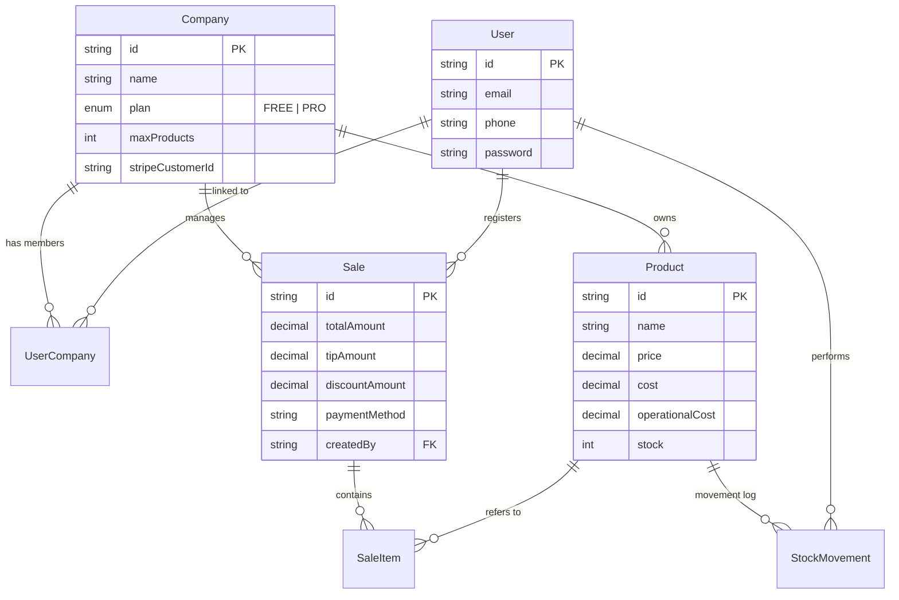

# 📦 KIPO

> **A modern, enterprise-ready inventory management system designed for multi-tenant scalability and precision.**

<div align="center">

[](./docs/README.pt-BR.md)

</div>

[](https://nextjs.org/)
[](https://reactjs.org/)
[](https://www.typescriptlang.org/)
[](https://www.prisma.io/)
[](https://tailwindcss.com/)
[](https://stripe.com/)
[](https://sentry.io/)

## 🎯 **Project Overview: KIPO - A Production-Grade SaaS Platform for Restaurant Operations**

KIPO is a highly scalable, multi-tenant SaaS solution (v1.4.0) meticulously engineered to revolutionize restaurant and food business management. It empowers owners with comprehensive inventory control, precise sales tracking, real-time Kitchen Display System (KDS), and robust team coordination with granular permissions. Designed for enterprise readiness, KIPO delivers deep financial insights through advanced analytics and ensures seamless scalability with integrated Stripe-powered subscription management.

### **Addressing Real-World Challenges:**

KIPO solves the complexities faced by small to medium-sized businesses in managing inventory and sales professionally and centrally. It moves beyond manual spreadsheets by offering:
- **Centralized Multi-tenant Control**: Manage multiple companies under a single account with complete data isolation.
- **Comprehensive Stock Audit**: Detailed logging of every movement (in, out, sale, adjustment) for full traceability.
- **Financial Intelligence**: Automated dashboards providing real-time profit, contribution margin, and cost history.
- **Proactive Stock Management**: Configurable low-stock alerts (`minStock`) to prevent shortages and optimize inventory levels.

### ✨ **Core SaaS Pillars**

- **🏢 Advanced Multi-tenancy**: Complete data isolation across companies. A single user can be part of multiple organizations with different roles.
- **📑 Modular Sales & POS (New)**: A completely refactored sales interface featuring specialized containers for Cart management, Customer selection, and real-time Financial Summaries. Supports **Venda Avulsa** (one-off sales) with precision.
- **🧑‍🍳 Kitchen Display System (KDS)**: Real-time order management system. Track order status across different prep stages with automatic synchronization via **SSE (Server-Sent Events)**.
- **🔔 CRM & Notification Center**: Integrated intelligence for customer relationships. Automatic alerts for birthdays, manual price adjustments with justification, and a global notification hub.
- **📉 Advanced Analytics & Reporting**: Deep financial engines that track revenue, profit, and margins. Export professional **XLSX reports** with calculated metrics for offline auditing.
- **👥 Identity & Team Management**: Professional role hierarchy (**Owner**, **Admin**, **Member**). Includes a frictionless **WhatsApp invitation flow**.

## 🚀 **Tech Stack**

### **The Engine**

| Technology | Role | Features |
| :--- | :--- | :--- |
| **Next.js 16** | Foundation | App Router, Server Actions, PPR (Partial Prerendering) |
| **React 19** | UI Library | Actions, UseOptimistic, Transitions, Enhanced Lifecycle |
| **Auth.js v5** | Security | Type-safe authentication & multi-tenant session management |
| **Prisma ORM** | Data | PostgreSQL integration with relational multi-tenant schema |
| **Stripe** | Revenue | Automated billing, webhooks, and subscription lifecycle |
| **Sentry** | Reliability | Full-stack error monitoring and performance tracing |

### **The Experience**

| Library | Description |
| :--- | :--- |
| **Tailwind CSS** | Premium glassmorphism and modern UI tokens |
| **shadcn/ui** | Robust components powered by Radix UI (Radix 1.x) |
| **Framer Motion** | Fluid micro-animations and smooth UI transitions |
| **ExcelJS** | High-performance generation of complex XLSX reports |
| **Recharts** | Dynamic data visualization for financial trends |
| **Sonner** | Interactive, global notification system |

## 📊 **Relational Architecture**


```mermaid
erDiagram
    Company ||--o{ UserCompany : "has members"
    User ||--o{ UserCompany : "linked to"
    Company ||--o{ Product : "owns"
    Company ||--o{ Sale : "manages"
    Sale ||--o{ SaleItem : "contains"
    Product ||--o{ SaleItem : "refers to"
    Product ||--o{ StockMovement : "movement log"
    User ||--o{ Sale : "registers"
    User ||--o{ StockMovement : "performs"

    Company {
        string id PK
        string name
        enum plan "FREE | PRO"
        int maxProducts
        string stripeCustomerId
    }

    User {
        string id PK
        string email
        string phone
        string password
    }

    Product {
        string id PK
        string name
        decimal price
        decimal cost
        decimal operationalCost
        int stock
    }

    Sale {
        string id PK
        decimal totalAmount
        decimal tipAmount
        decimal discountAmount
        string paymentMethod
        string createdBy FK
    }
```

## 🛠️ **Installation & Setup**

### **1. Rapid Deployment**

```bash
git clone https://github.com/tonelopes-dev/stock-manager
npm install
npx prisma generate
```

### **2. Development Mode**

```bash
# Start the development server
npm run dev

# Run database migrations
npx prisma migrate dev
```

## 📁 **Project Structure**

```bash
kipo/
├── app/
│   ├── (protected)/        # Dashboard, Sales (PDV), Products, Team, CRM
│   ├── auth/               # Login, Password recovery flow
│   ├── _actions/           # Transactional Server Actions (the core logic)
│   ├── _data-access/       # Clean Room Data Access Layer (Repository Pattern)
│   ├── _lib/               # Core configs (Auth, RBAC, Prisma, Stripe)
│   └── _components/        # Reusable global UI (Notification Center, Layout)
├── prisma/                 # Relational Schema with Multi-tenant isolation
└── docs/                   # Additional documentation and PT-BR README
```

## 🏛️ **Architecture & Code Patterns**

KIPO follows enterprise-grade architectural patterns that ensure code quality, security, and scalability:

### **Clean 3-Layer Separation**
```
UI Layer (React Components)
    ↓
Action Layer (Server Actions - Type-safe API)
    ↓
Data Access Layer (Repository Pattern - CRUD operations)
    ↓
Database (PostgreSQL + Prisma)
```

### **Key Architectural Principles**

- **Multi-Tenancy by Design**: Every query enforces `companyId` isolation at the ORM level. Data breaches between tenants are architecturally impossible.
- **Type-Safe Server Actions**: Leverages Next.js Server Actions with Zod validation for end-to-end type safety from client to database.
- **Role-Based Access Control (RBAC)**: Granular permissions system (`OWNER` > `ADMIN` > `MEMBER` > `VIEWER`) with 13+ capability checks for sensitive operations.
- **Data Transfer Objects (DTOs)**: Clean separation of database models from API responses. Raw Prisma models never leave the data access layer.
- **Performance Optimization**: Strategic use of Prisma `select()` (never `include()`) to prevent N+1 queries and optimize response times.
- **Error Handling**: Centralized error handling via `safe-action` wrapper with Portuguese user messages and English logs for debugging.

### **Testing & Quality Assurance**

- **Unit Tests**: Vitest for business logic validation
- **Integration Tests**: Testing Server Actions with database interactions
- **E2E Tests**: Playwright for user workflows (login, sales, reports, etc.)
- **Type Safety**: Strict TypeScript mode with no implicit `any` types

## 🔐 **Security & Compliance**

- ✅ Multi-tenant data isolation enforced at ORM level
- ✅ Row-level security patterns via `companyId` filtering
- ✅ Password hashing with industry-standard algorithms
- ✅ JWT-based session management with Prisma storage
- ✅ RBAC permission checks on every sensitive operation
- ✅ Sentry integration for real-time error monitoring and performance tracking
- ✅ Audit logging for compliance and accountability

---

<div align="center">

**KIPO - Empowering Modern Inventory & Sales Management**

[🌐 Access Kipo](https://usekipo.com.br/) • [🛠️ Issues](https://github.com/tonelopes-dev/stock-manager/issues) • [📖 Technical Docs](./docs/)

</div>

## 💼 **For Developers & Tech Leaders**

This codebase demonstrates:
- **Enterprise Architecture**: Clean separation of concerns with real-world multi-tenancy
- **Modern TypeScript**: Strict mode with end-to-end type safety
- **Best Practices**: SOLID principles, design patterns, and scalable folder structures
- **Production-Ready Code**: Error handling, monitoring, testing, and documentation

**Interested in joining the team or collaborating?** Reach out via [GitHub Issues](https://github.com/tonelopes-dev/stock-manager/issues) or visit our website.

## 📄 **License & Attribution**

KIPO is built with ❤️ and serves as a reference implementation for SaaS platforms. For licensing details, see the [LICENSE](./LICENSE) file.

---

<div align="center">

**Elevating restaurant operations through modern technology.** ✨

</div>
