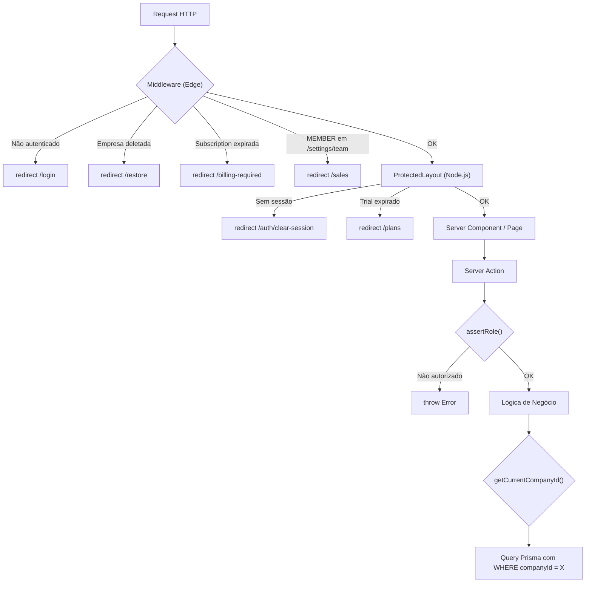

# 01 — Autenticação & Permissões

> **Ficheiros-chave:** `_lib/auth.ts` · `_lib/auth.config.ts` · `_lib/rbac.ts` · `_lib/get-current-company.ts` · `_lib/safe-action.ts` · `middleware.ts` · `prisma/schema.prisma` (User, UserCompany, CompanyInvitation)

Este capítulo documenta a arquitetura de autenticação multi-tenant do Kipo ERP: como sessões são geridas, como o RBAC funciona em 3 camadas e como o isolamento de dados é garantido.

---

## 1. Stack de Autenticação

| Componente | Tecnologia | Versão |
|---|---|---|
| Auth Framework | NextAuth v5 (`next-auth`) | 5.x |
| Adapter | `@auth/prisma-adapter` (PrismaAdapter) | — |
| Provider | `Credentials` (email/password) | — |
| Hash | `bcryptjs` | — |
| Sessão | JWT (stateless) | — |
| Validação de Actions | `next-safe-action` | — |

---

## 2. Modelos do Banco de Dados

### `User`

| Campo | Tipo | Descrição |
|---|---|---|
| `id` | `String (cuid)` | Identificador único do utilizador. |
| `email` | `String (unique)` | Email de login. |
| `password` | `String?` | Hash bcrypt da password. |
| `sessionVersion` | `Int (default: 0)` | Incrementado para invalidar sessões ativas (ex: transferência de posse). |
| `needsPasswordChange` | `Boolean` | Flag para forçar o `PasswordResetModal` no layout protegido. |
| `resetPasswordToken` | `String? (unique)` | Token de reset de password com expiração (`resetPasswordExpires`). |

### `UserCompany` (Tabela Pivô Multi-tenant)

```prisma
model UserCompany {
  id        String   @id @default(cuid())
  userId    String
  companyId String
  role      UserRole @default(MEMBER)

  @@unique([userId, companyId])
}
```

**Um User pode pertencer a várias Companies**, e cada associação tem um `role` independente. O sistema atualmente usa `take: 1` no JWT callback para selecionar a primeira empresa do utilizador.

### `CompanyInvitation`

| Campo | Tipo | Descrição |
|---|---|---|
| `email` | `String` | Email do convidado. |
| `role` | `UserRole` | Papel a ser atribuído após aceitar. |
| `status` | `InvitationStatus` | `PENDING`, `ACCEPTED`, `REJECTED`. |

**Constraint:** `@@unique([email, companyId, status])` — Impede convites duplicados com o mesmo estado.

### `UserRole` (Enum)

```
OWNER  → Dono da empresa. Tudo permitido, incluindo destruição e transferência.
ADMIN  → Administrador. Gestão completa, exceto planos e billing.
MEMBER → Membro operacional. PDV, KDS, vendas do dia-a-dia.
```

---

## 3. Fluxo de Login (Credentials Provider)

**Ficheiro:** `_lib/auth.ts` (L12-50)

```
1. Cliente envia { email, password }
2. auth.ts → Credentials.authorize():
   a. db.user.findUnique({ where: { email } })
   b. Se não existe ou sem password → return null (401)
   c. bcrypt.compare(password, user.password)
   d. Se não confere → return null (401)
   e. return { id, email, name, sessionVersion }
```

---

## 4. Ciclo de Vida do JWT

O JWT é o artefacto central da sessão. A cada request, o callback `jwt()` é executado:

**Ficheiro:** `_lib/auth.ts` (L52-103)

```
jwt({ token, user, trigger, session }) {
  // 1. Primeiro login: Copia user → token
  if (user) {
    token.id = user.id
    token.sessionVersion = user.sessionVersion
  }

  // 2. Update manual (ex: useSession().update())
  if (trigger === "update") {
    token.companyId = session.user.companyId
    token.role = session.user.role
  }

  // 3. Fetch fresh data do banco (a cada request!)
  const dbUser = db.user.findUnique({
    where: { id: token.id },
    select: {
      sessionVersion,
      userCompanies: {
        select: { companyId, role, company: { select: { subscriptionStatus, deletedAt } } },
        take: 1
      }
    }
  })

  // 4. SESSION INVALIDATION: Se sessionVersion no banco > token → Force sign out
  if (!dbUser || dbUser.sessionVersion > token.sessionVersion) {
    return null  // ← NextAuth interpreta como logout
  }

  // 5. Populate: companyId, role, subscriptionStatus, companyDeletedAt
  token.companyId = userCompany.companyId
  token.role = userCompany.role
  token.subscriptionStatus = company.subscriptionStatus
  token.companyDeletedAt = company.deletedAt
}
```

### `sessionVersion` — Invalidação de Sessão Remota

Quando uma ação destrutiva acontece (transferência de posse, força de logout):

```
db.user.update({ sessionVersion: { increment: 1 } })
→ Próximo request do utilizador → JWT callback detecta mismatch → return null → Logout
```

### Session Shape (Disponível em `auth()`)

```typescript
session.user = {
  id: string;
  email: string;
  name: string;
  companyId: string;
  role: UserRole;              // OWNER | ADMIN | MEMBER
  subscriptionStatus?: string; // ACTIVE | TRIALING | PAST_DUE | CANCELED | INCOMPLETE
  companyDeletedAt?: string;   // ISO date se empresa está em soft delete
}
```

---

## 5. Separação Edge vs. Node.js

O NextAuth v5 tem uma restrição: o **Edge Runtime** (middleware) **não pode importar Prisma** (que requer Node.js). A solução:

| Ficheiro | Runtime | O que faz |
|---|---|---|
| `auth.config.ts` | Edge ✅ | Callbacks JWT/session **sem** Prisma. Apenas mapeia campos entre token ↔ session. |
| `auth.ts` | Node.js ✅ | Estende `authConfig` com Providers e callbacks **com** Prisma (fetch de sessionVersion, role). |
| `middleware.ts` | Edge ✅ | Importa apenas `authConfig` (sem Prisma). Lê `req.auth` (token decodificado). |

---

## 6. Middleware — Camada 1 de Proteção

**Ficheiro:** `middleware.ts` (146 linhas)

O middleware executa em **todas as rotas** (`matcher: [/((?!api|_next|favicon.ico).*)]`) e implementa 3 guardas:

### 6.1. Guarda de Autenticação

```
Rotas Públicas: /, /login, /register, /plans, /checkout, /menu/*, /prints/*
API Auth:       /api/auth/* (NextAuth handlers)
Webhooks:       /api/webhooks/*

Se NÃO autenticado E NÃO é rota pública → redirect("/login")
Se autenticado E em /login ou /register → redirect("/sales")
```

### 6.2. Lifecycle Guards

| Guarda | Condição | Comportamento |
|---|---|---|
| **Soft Delete** | `companyDeletedAt` está preenchido | OWNER → redirect `/settings/company/restore`. Outros → redirect `/login?reason=company_deactivated`. |
| **Subscription** | `subscriptionStatus` em `PAST_DUE`, `CANCELED`, `INCOMPLETE` | redirect `/billing-required` (todos os roles). |

### 6.3. RBAC Guard (Rotas)

| Role | Restrição de Rota |
|---|---|
| `OWNER` | Nenhuma. Acesso total. |
| `ADMIN` | Bloqueado de `/plans` (billing). |
| `MEMBER` | Bloqueado de `/plans` E `/settings/team`. |

### 6.4. Session Clearing (Nuclear Option)

Rota especial `/auth/clear-session`:

```
Clear-Site-Data: "cookies", "storage", "cache"
Cache-Control: no-store, max-age=0, must-revalidate
+ Delete manual de cookies auth/session
```

Usado em transferência de posse (`reason=ownership_transferred`).

### 6.5. Header Injection

O middleware injeta `x-pathname` nos headers da request, permitindo que o Server Component `ProtectedLayout` leia a rota atual sem depender do client:

```typescript
requestHeaders.set("x-pathname", pathname);
```

---

## 7. Layout Protegido — Camada 2 de Proteção

**Ficheiro:** `(protected)/layout.tsx` (85 linhas)

Executa **após** o middleware e adiciona guardas server-side:

```
1. auth() → Se null → redirect("/auth/clear-session?reason=invalid_session")
2. getCurrentCompanyId() → Garante que o user tem empresa (auto-cria se necessário)
3. getUserSecurityStatus() → needsPasswordChange → PasswordResetModal
4. getCompanyPlan() → expiresAt
5. Se !isEssentialRoute AND expiresAt < now → redirect("/plans")
```

**Rotas essenciais (nunca bloqueadas):** `/plans`, `/checkout`, `/billing-required`, `/profile`.

---

## 8. RBAC — Camada 3 de Proteção (Server Actions)

**Ficheiro:** `_lib/rbac.ts` (49 linhas)

### `getCurrentUserRole()`

Busca o `role` do utilizador na empresa atual via `UserCompany`:

```typescript
db.userCompany.findUnique({
  where: { userId_companyId: { userId, companyId } },
  select: { role: true }
})
```

### `assertRole(allowedRoles)`

Usada como guarda dentro de Server Actions:

```typescript
// Exemplo: Apenas OWNER e ADMIN podem alterar promoções
export const updateProductPromotion = actionClient
  .schema(updateProductPromotionSchema)
  .action(async ({ parsedInput }) => {
    await assertRole(ADMIN_AND_OWNER); // ← Lança erro se MEMBER
    // ... lógica
  });
```

### Helpers

```typescript
export const OWNER_ONLY = [UserRole.OWNER];
export const ADMIN_AND_OWNER = [UserRole.OWNER, UserRole.ADMIN];
export const ALL_ROLES = [UserRole.OWNER, UserRole.ADMIN, UserRole.MEMBER];
```

---

## 9. `getCurrentCompanyId()` — Resolvedor de Tenant

**Ficheiro:** `_lib/get-current-company.ts` (56 linhas)

Função central que resolve o `companyId` do utilizador logado:

```
1. auth() → session.user.companyId → return (se já está no JWT)
2. db.userCompany.findFirst({ userId }) → return companyId
3. Se nenhuma empresa existe:
   a. Auto-cria Company com slug gerado (nome normalizado + random suffix)
   b. Auto-cria UserCompany com role: OWNER
   c. return companyId
```

**Importância:** **Todas** as queries Prisma no backoffice usam `companyId` como filtro. Se esta função falhar, nenhum dado é acessível.

---

## 10. `safe-action` — Framework de Server Actions

**Ficheiro:** `_lib/safe-action.ts` (77 linhas)

### Error Handler

Centraliza o tratamento de erros do Prisma para mensagens user-friendly:

| Código Prisma | Mensagem ao Utilizador |
|---|---|
| `P2002` (Unique constraint) | "Já existe um item com este nome/SKU nesta empresa." |
| `P2003` (FK constraint) | "Erro de integridade: registro relacionado não encontrado." |
| `P2025` (Not found) | "O registro solicitado não foi encontrado." |
| Invocation error | "Erro interno no banco de dados." (log no console) |

### Middleware de Logging

Toda Server Action passa por um middleware que:
1. Mede a duração da execução.
2. Loga `VALIDATION ERROR` se o Zod rejeitou o input.
3. Loga `SERVER ACTION ERROR` se ocorreu uma exceção não tratada.

---

## 11. Diagrama: 3 Camadas de Proteção



---

## 12. Checklist Zero Trust (Resumo)

Toda Server Action deve cumprir:

- [ ] Schema Zod via `actionClient.schema()` (validação de input)
- [ ] `auth()` ou `assertRole()` (autenticação + autorização)
- [ ] `getCurrentCompanyId()` como filtro em **toda** query (isolamento)
- [ ] Nenhum campo além dos definidos no schema pode ser atualizado (anti over-posting)
- [ ] Erros Prisma tratados pelo `handleServerError` centralizado
