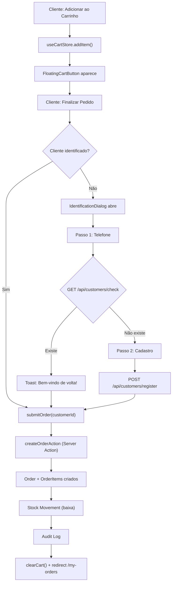

# 02 — Cardápio Digital

> **Ficheiros-chave:** `(public)/[companySlug]/_components/menu-client.tsx` · `_store/use-cart-store.ts` · `_components/bottom-nav.tsx` · `_components/identification-dialog.tsx` · `_data-access/menu/get-menu-data.ts` · `_actions/order/create-order/index.ts`

Este capítulo documenta o frontend público do cardápio digital: como os dados são carregados, como a sacola funciona client-side, como o cliente se identifica e como o pedido é submetido.

---

## 1. Arquitetura Geral

```
URL: /{companySlug}

Camada Server (RSC)                    Camada Client
┌──────────────────────┐              ┌────────────────────────────┐
│ page.tsx             │              │ MenuClient (orquestrador)  │
│  ↓                   │              │  ├── MenuHeader            │
│ getMenuDataBySlug()  │──SSR────→    │  ├── CategoryNav           │
│  ↓ validação slug    │              │  ├── ProductSection[]      │
│ notFound() se null   │              │  ├── ProductDetailsSheet   │
└──────────────────────┘              │  ├── FloatingCartButton    │
                                      │  ├── BottomNav             │
                                      │  ├── IdentificationDialog  │
                                      │  └── Store Info Dialog     │
                                      └─────────────┬──────────────┘
                                                    │
                                      useCartStore (Zustand + persist)
                                      localStorage: "kipo-cart-storage"
```

**Fluxo:**
1. Server Component resolve o `companySlug` via `getMenuDataBySlug(slug)`.
2. Se slug não existe → `notFound()` (HTTP 404).
3. Dados do menu (categorias, produtos, branding) são passados como `menuData` ao `MenuClient`.
4. Todo o estado da sacola é gerido client-side via Zustand, persistido em `localStorage`.

---

## 2. Resolução de Slug e Proteção de Rota

**Ficheiro:** `_data-access/menu/get-menu-data.ts`

### `getMenuDataBySlug(slug: string)`

```typescript
const company = db.company.findUnique({
  where: { slug },
  select: { id, slug, name, bannerUrl, logoUrl, address, description,
            whatsappNumber, instagramUrl, operatingHours }
});
if (!company) return null;  // ← page.tsx chama notFound()
```

### `fetchMenuDetails(company, companyId)`

Carrega categorias e produtos visíveis:

```
WHERE companyId = X
  AND isVisibleOnMenu = true
  AND isActive = true
ORDER BY category.orderIndex ASC, product.name ASC
```

**Select otimizado** — Apenas campos necessários para o menu:

```typescript
select: {
  id, name, description, imageUrl, price,
  promoActive, promoPrice, promoSchedule, isFeatured
}
```

**Produtos sem categoria:** Agrupados automaticamente numa categoria virtual "Destaques" (⭐) inserida no topo da lista.

### DTO

```typescript
interface MenuDataDto {
  id: string;
  slug: string;
  companyName: string;
  bannerUrl: string | null;
  logoUrl: string | null;
  address: string | null;
  description: string | null;
  whatsappNumber: string | null;
  instagramUrl: string | null;
  operatingHours: any;           // JSON com horários por dia
  categories: MenuCategoryDto[];
}

interface MenuProductDto {
  id: string;
  name: string;
  description: string | null;
  imageUrl: string | null;
  price: number;
  promoActive: boolean;
  promoPrice: number | null;
  promoSchedule: any;           // JSON com regras de agendamento
  isFeatured: boolean;
}
```

---

## 3. `MenuClient` — Orquestrador

**Ficheiro:** `(public)/[companySlug]/_components/menu-client.tsx` (496 linhas)

### Props

```typescript
interface MenuClientProps {
  companyId: string;
  menuData: MenuDataDto;
  customerData?: any;       // Cliente pré-identificado (se existir no localStorage)
  tableNumber: string | null; // Query param ?table=5
}
```

### Estado Gerido

| Estado | Tipo | Propósito |
|---|---|---|
| `search` | `string` | Filtro de busca textual. |
| `selectedCategoryId` | `string` | Categoria ativa no `CategoryNav` para scroll. |
| `isStoreInfoOpen` | `boolean` | Modal de informações da loja. |
| `selectedProduct` | `any` | Produto selecionado para `ProductDetailsSheet`. |
| `showIdentifyDialog` | `boolean` | Dialog de identificação do cliente. |
| `identifyStep` | `"PHONE" \| "DETAILS"` | Etapa do fluxo de identificação. |
| `customer` | `any` | Dados do cliente identificado. |
| `isSubmitting` | `boolean` | Loading do submit do pedido. |

### Filtro de Busca

```typescript
const filteredCategories = useMemo(() => {
  if (!search) return menuData.categories;
  return menuData.categories
    .map(cat => ({
      ...cat,
      products: cat.products.filter(p =>
        p.name.toLowerCase().includes(search) ||
        p.description?.toLowerCase().includes(search)
      ),
    }))
    .filter(cat => cat.products.length > 0);
}, [search, menuData.categories]);
```

### Destaques ("Highlights")

```typescript
const highlights = useMemo(() =>
  menuData.categories
    .flatMap(c => c.products)
    .filter(p => p.isFeatured)
    .slice(0, 8),  // Máximo 8 na carousel
[menuData.categories]);
```

Exibidos num carrossel horizontal com snap scrolling no topo do menu.

### Scroll por Categoria

```typescript
scrollToCategory(categoryId) {
  const element = document.getElementById(`category-${categoryId}`);
  // Scroll suave com offset de 140px (altura do header fixo)
  window.scrollTo({ top: offsetPosition, behavior: "smooth" });
}
```

---

## 4. `useCartStore` — Estado da Sacola (Zustand)

**Ficheiro:** `(public)/[companySlug]/_store/use-cart-store.ts` (82 linhas)

### Schema

```typescript
interface CartItem {
  id: string;        // productId + hash do notes (entryId)
  productId: string;
  name: string;
  price: number;
  quantity: number;
  image?: string;
  notes?: string;
}

interface CartStore {
  items: CartItem[];
  totalAmount: number;  // Soma calculada (price × quantity)
  totalItems: number;   // Soma das quantidades
  addItem(item): void;
  removeItem(id): void;
  updateQuantity(id, quantity): void;
  clearCart(): void;
}
```

### Persistência

```typescript
persist(storeFactory, { name: "kipo-cart-storage" })
```

Usa `zustand/middleware/persist` com `localStorage`. O carrinho sobrevive a reloads e navegação.

### Lógica de Deduplicação (`addItem`)

O `id` do item no carrinho é gerado como: `${productId}-${notes || ""}`.

```
Se o item já existe (mesmo produto + mesma observação):
  → Incrementa quantity no item existente
Senão:
  → Adiciona novo item ao array
```

**Implicação:** Se o cliente adiciona "Pizza sem cebola" e depois "Pizza com extra queijo", são 2 itens separados no carrinho.

### Recálculo Automático

Após qualquer mutação (`addItem`, `removeItem`, `updateQuantity`):

```typescript
totalItems = items.reduce((acc, item) => acc + item.quantity, 0);
totalAmount = items.reduce((acc, item) => acc + item.price * item.quantity, 0);
```

---

## 5. Fluxo de Identificação do Cliente

O cliente **não tem conta** no sistema (não é um `User`). É um `Customer` — um registro leve vinculado à empresa.

### Fluxo

```
1. Cliente clica "Finalizar Pedido"
2. Se já está identificado (customer !== null) → submitOrder()
3. Se NÃO → Abre IdentificationDialog

  Passo 1: PHONE
    ├── Cliente digita telefone
    ├── handleIdentifyPhone() → GET /api/customers/check?phone=X&companyId=Y
    ├── Se existe → setCustomer(data) → submitOrder(customerId)
    └── Se não existe → Avança para DETAILS

  Passo 2: DETAILS
    ├── Cliente preenche: nome*, email (opcional), birthDate (opcional)
    ├── handleRegister() → POST /api/customers/register { ...form, companyId }
    ├── Se sucesso → setCustomer(data) → submitOrder(customerId)
    └── Se erro → toast de erro
```

### API Routes

| Rota | Método | Descrição |
|---|---|---|
| `/api/customers/check` | `GET` | Busca `Customer` por `phoneNumber` + `companyId`. |
| `/api/customers/register` | `POST` | Cria ou atualiza `Customer`. Se novo: vincula à categoria e etapa 'Cardápio Digital'. Se existente: preserva etapa e atualiza dados faltantes. |

### Regras de Automação CRM

Para garantir que todo cliente vindo do cardápio digital seja capturado pelo time comercial:

1.  **Etapa 'Cardápio Digital'**: Se não existir, o sistema cria automaticamente esta coluna no CRM.
2.  **Prioridade**: A coluna 'Cardápio Digital' é configurada com `order: 0`, aparecendo sempre como a primeira da esquerda no Kanban.
3.  **Posicionamento**: Novos clientes entram sempre no **topo** da coluna (`position: 0`).
4.  **Preservação de Funil**: Se um cliente já existir no CRM e estiver em qualquer outra etapa (ex: "Convertido"), o sistema **não** altera sua etapa. Apenas atualiza dados como foto, e-mail e data de nascimento se estes estiverem em branco.
5.  **Tagging**: Todo novo cliente recebe automaticamente a tag (categoria) "Cardápio Digital".

Após identificação, o `customerId` é salvo em `localStorage`:

```typescript
localStorage.setItem(`kipo-customer-${companyId}`, JSON.stringify({
  customerId: data.customer.customerId,
  name: data.customer.name
}));
```

Usado em `my-orders-client.tsx` para buscar pedidos do cliente.

---

## 6. `IdentificationDialog` — Componente Extraído

**Ficheiro:** `(public)/[companySlug]/_components/identification-dialog.tsx` (175 linhas)

Componente atômico extraído do `menu-client.tsx` (Lei do Escoteiro). Recebe:

| Prop | Tipo | Descrição |
|---|---|---|
| `open` / `onOpenChange` | `boolean` / `fn` | Controle do Dialog. |
| `step` / `setStep` | `"PHONE" \| "DETAILS"` / `fn` | Etapa atual. |
| `form` / `setForm` | `object` / `fn` | Dados do formulário (phoneNumber, name, email, birthDate). |
| `isIdentifying` | `boolean` | Loading state da verificação. |
| `onIdentify` | `() => void` | Callback principal — decide entre `handleIdentifyPhone` ou `handleRegister`. |

---

## 7. Submissão do Pedido

**Ficheiro:** `menu-client.tsx` (L197-227)

```typescript
const submitOrder = async (customerId: string) => {
  const items = useCartStore.getState().items;
  if (items.length === 0) return;

  const result = await createOrderAction({
    companyId,
    customerId,
    tableNumber: tableNumber ?? undefined,
    items: items.map(item => ({
      productId: item.id,   // Atenção: usa o entryId do cart, não productId!
      quantity: item.quantity,
      notes: item.notes,
    })),
  });

  if (result?.data?.success && result.data.orderId) {
    useCartStore.getState().clearCart();  // Limpa sacola
    router.push(`/menu/${companyId}/my-orders`);  // Redireciona
  }
};
```

**Server Action:** `createOrderAction` → valida produtos, calcula preços, cria `Order` + `OrderItems`, dispara `processBatchStockMovement` (capítulo 03) e `AuditService.logWithTransaction` (capítulo 01).

---

## 8. `BottomNav` — Navegação Inferior

**Ficheiro:** `(public)/[companySlug]/_components/bottom-nav.tsx` (82 linhas)

Barra de navegação fixa no rodapé com 4 tabs:

| Tab | Ícone | Rota | Estado |
|---|---|---|---|
| Início | `Home` | `/{companySlug}` | ✅ Implementado |
| Promoções | `Tag` | `/{companySlug}/promotions` | ⚠️ Não implementado |
| Pedidos | `Receipt` | `/{companySlug}/my-orders` | ✅ Implementado |
| Perfil | `User` | `/{companySlug}/profile` | ⚠️ Não implementado |

**Prop crítica:** Recebe `companySlug` (string) — resolvido via `menuData.slug`. Corrigido na sessão anterior para evitar URLs com `/undefined/`.

### Detecção de Rota Ativa

```typescript
const isActive = pathname === tab.href ||
  (tab.id === "home" && pathname === `/${companySlug}`);
```

---

## 9. Componentes do Menu

### `MenuHeader`

Exibe: logo da empresa, nome, status (aberto/fechado), botão de informações, avatar do cliente logado (se identificado), indicador de mesa (query param `?table=`).

### `CategoryNav`

Barra horizontal com scroll de categorias. Ao clicar, `scrollToCategory()` faz scroll suave até a secção correspondente.

### `ProductSection`

Renderiza uma secção do menu: título da categoria + lista de cards de produtos. Cada card exibe: imagem, nome, descrição truncada, preço (com preço riscado se `promoActive` e `promoPrice`), e botão de adicionar.

### `ProductDetailsSheet`

Sheet lateral com detalhes do produto selecionado: imagem em grande, descrição completa, campo de observação (`notes`), seletor de quantidade, e botão "Adicionar à sacola" que chama `useCartStore.addItem()`.

### `FloatingCartButton`

Botão flutuante que aparece quando `totalItems > 0`. Exibe total de itens e valor total. Navega para a tela de checkout ou dispara `handleCheckout()`.

---

## 10. Store Info Dialog

Modal de informações da loja com 2 tabs:

| Tab | Conteúdo |
|---|---|
| **Sobre** | Logo, descrição, link Instagram, WhatsApp, telefone, endereço. |
| **Horário** | Grade semanal com horários de funcionamento. Destaca o dia atual. Horários vêm de `menuData.operatingHours` (JSON) ou fallback `DEFAULT_HOURS`. |

---

## 11. Diagrama de Fluxo: Checkout


