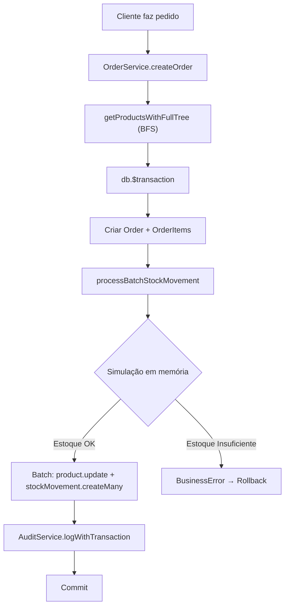

# 03 — Gestão de Estoque

> **Ficheiros-chave:** `_lib/stock.ts` · `_services/order.ts` · `prisma/schema.prisma` (Product, StockMovement, ProductComposition, StockEntry)

Este capítulo documenta o motor de estoque do Kipo ERP: como a baixa decimal funciona, como a composição recursiva ("Ficha Técnica") é processada e quais decisões arquiteturais garantem integridade e performance.

---

## 1. Modelos do Banco de Dados

### `Product` (Campos de Estoque)

| Campo | Tipo | Descrição |
|---|---|---|
| `stock` | `Decimal(10,4)` | Saldo atual do produto. Precisão de 4 casas para suportar frações (ex: 0.750 KG). |
| `minStock` | `Decimal(10,4)` | Nível mínimo para alertas de reposição no dashboard. |
| `unit` | `UnitType` | Unidade de medida: `KG`, `G`, `L`, `ML`, `UN`, `PCT`, `MC`. |
| `isMadeToOrder` | `Boolean` | Se `true`, o produto possui **Ficha Técnica** e sua venda dispara baixa recursiva nos ingredientes. |
| `isActive` | `Boolean` | Produto desativado não pode ser vendido (`OrderService.createOrder` valida). |

**Constraints de integridade:**
```
@@unique([sku, companyId])
@@unique([name, companyId])
```

### `ProductComposition` (Ficha Técnica)

| Campo | Tipo | Descrição |
|---|---|---|
| `parentId` | `String` | Produto pai (ex: "Pizza Margherita"). |
| `childId` | `String` | Ingrediente/insumo (ex: "Massa de Pizza"). |
| `quantity` | `Decimal(10,4)` | Quantidade do ingrediente consumida por unidade do produto pai. |

**Constraint:** `@@unique([parentId, childId])` — Não permite duplicatas na mesma composição.

**Relações recursivas no schema:**
```prisma
parentCompositions ProductComposition[] @relation("ParentProduct")
childCompositions  ProductComposition[] @relation("ChildProduct")
```

> **Por que recursão?** Um produto pode ser composto por outros produtos que, por sua vez, também são compostos. Exemplo: Pizza → Massa → Farinha + Água. A árvore é percorrida por BFS no motor de lote.

### `StockMovement` (Registro de Movimentação)

| Campo | Tipo | Descrição |
|---|---|---|
| `type` | `StockMovementType` | Enum: `ORDER`, `SALE`, `CANCEL`, `ADJUSTMENT`, `PURCHASE`, `PRODUCTION`, `WASTE`, `MANUAL`. |
| `stockBefore` | `Decimal(10,4)` | Snapshot do saldo **antes** da movimentação. |
| `stockAfter` | `Decimal(10,4)` | Snapshot do saldo **depois** da movimentação. |
| `quantityDecimal` | `Decimal(10,4)` | Delta aplicado (positivo = entrada, negativo = saída). |
| `unit` | `UnitType?` | Unidade de medida no momento do registro. |
| `orderId` | `String?` | FK para `Order` — vincula a movimentação ao pedido que a gerou. |
| `saleId` | `String?` | FK para `Sale` — atualizada quando o pedido é convertido em venda paga. |
| `reason` | `String?` | Justificativa para movimentações manuais e cancelamentos. |

### `StockEntry` (Entrada de Mercadoria)

| Campo | Tipo | Descrição |
|---|---|---|
| `quantity` | `Decimal(10,4)` | Quantidade recebida. |
| `unitCost` | `Decimal(10,2)` | Custo unitário pago ao fornecedor. |
| `totalCost` | `Decimal(10,2)` | Custo total (`quantity × unitCost`). |
| `supplierId` | `String?` | FK para `Supplier`. |
| `batchNumber` | `String?` | Lote para rastreabilidade. |
| `invoiceNumber` | `String?` | Número da nota fiscal. |
| `expirationDate` | `DateTime?` | Validade do lote. |

---

## 2. Por Que Decimal(10,4)?

A decisão de usar `Decimal(10,4)` em vez de `Float` ou `Int` é **crítica** para um ERP de restaurante:

| Cenário | Float | Int (centésimos) | Decimal(10,4) ✅ |
|---|---|---|---|
| 0.750 KG de carne | Erro de arredondamento: `0.7499999...` | Requer conversão constante | Exato: `0.7500` |
| 1/3 de litro de leite | `0.33333...` acumula erro | `33` (gambiarra) | `0.3333` — truncado com precisão controlada |
| Soma de 10.000 movimentações | Drift acumulado significativo | Correto mas sem casas fracionárias | Soma exata sem drift |

O Prisma usa `Prisma.Decimal` (baseado em `decimal.js`) para todas as operações aritméticas no TypeScript, evitando a armadilha do IEEE 754.

---

## 3. Arquitetura do Motor de Estoque (`_lib/stock.ts`)

O ficheiro `_lib/stock.ts` exporta 4 funções. A evolução foi:

```
recordStockMovement (v1, unitário)
    ↓
processRecursiveStockMovement (v2, recursivo — @deprecated)
    ↓
processBatchStockMovement (v3, lote com simulação — ATUAL)
    ↑
getProductsWithFullTree (helper BFS para pré-fetch)
```

### 3.1. `recordStockMovement` — Motor Unitário

**Ficheiro:** `_lib/stock.ts` (L22-100)

Função base que movimenta o estoque de **um único produto**. Lógica:

1. Converte `quantity` para `Prisma.Decimal`.
2. Executa `product.update({ stock: { increment: qty } })` atomicamente.
3. Calcula `stockBefore = stockAfter - qty` (derivado do resultado do update).
4. **Validação de estoque negativo:** Se o saldo resultante < 0:
   - Verifica `company.allowNegativeStock` (flag por empresa).
   - Verifica `forceAllowNegative` (flag do chamador, usada para ingredientes de produtos compostos).
   - Se ambos `false` → lança `BusinessError`.
5. Cria o registro `StockMovement` com o snapshot before/after.

### 3.2. `getProductsWithFullTree` — Pré-Fetch por BFS

**Ficheiro:** `_lib/stock.ts` (L106-138)

Executa um **Breadth-First Search** na árvore de composição:

```
Input: [Pizza Margherita ID]
BFS Nível 1: Busca Pizza → encontra parentCompositions → [Massa ID, Molho ID]
BFS Nível 2: Busca Massa → encontra parentCompositions → [Farinha ID, Água ID]
BFS Nível 3: Farinha e Água não têm filhos → FIM
Output: Map<string, Product> com 5 produtos completos
```

**Por que antes da transação?** Executar queries SELECT durante uma transação `$transaction` do Prisma mantém locks desnecessários. O BFS é feito **fora** da transação, e o `Map` pré-carregado é passado para o motor de lote.

### 3.3. `processBatchStockMovement` — Motor de Lote (ATUAL)

**Ficheiro:** `_lib/stock.ts` (L157-252)

Este é o motor principal. Foi criado para resolver o problema de N+1 queries que existia na versão recursiva.

**Algoritmo em 4 fases:**

```
Fase 1: Carregamento (getProductsWithFullTree ou preFetchedProducts)
    ↓
Fase 2: Simulação em memória (JS puro, zero I/O)
    ↓ → Valida regras de negócio sem tocar no banco
Fase 3: Consolidação de deltas por produto
    ↓ → Agrupa múltiplas movimentações do mesmo produto
Fase 4: Execução atômica (batch writes no Prisma)
    → product.update (incrementos consolidados)
    → stockMovement.createMany (todos os registros de uma vez)
```

**Fase 2 — Simulação Recursiva (`computeRecursively`):**

```typescript
const computeRecursively = (pid, qty, mParams, forceAllow?) => {
  const product = productMap.get(pid);
  const currentStock = simulatedStocks.get(pid);
  const newStock = currentStock.plus(qty);

  // Regra: isMadeToOrder com ingredientes → forceAllowNegative=true para o pai
  // Ingredientes respeitam a config da empresa (forceAllow=false)
  if (newStock < 0 && !allowNegativeStock && !isForced) {
    throw BusinessError; // Aborta toda a transação
  }

  simulatedStocks.set(pid, newStock);  // Atualiza estado simulado
  pendingUpdates.push({ pid, delta }); // Registra para batch write

  // Recursão se o produto é composto
  if (product.isMadeToOrder && hasIngredients) {
    for (const comp of product.parentCompositions) {
      computeRecursively(comp.childId, qty * comp.quantity, mParams, false);
    }
  }
};
```

**Regra de `forceAllowNegative`:**
- Produtos `isMadeToOrder` com ingredientes: o **pai** pode ficar negativo (ele é virtual).
- Os **ingredientes filhos** respeitam `company.allowNegativeStock`.

**Fase 4 — Consolidação:**
Se um pedido tem "2x Pizza + 1x Calzone" e ambos usam "Massa", o motor consolida os deltas da Massa em uma única operação de update ao invés de duas.

### 3.4. `processRecursiveStockMovement` — @deprecated

Mantida apenas para compatibilidade. Internamente delega para `processBatchStockMovement` com array de 1 item.

---

## 4. Fluxo de Baixa: Pedido → Estoque

Sequência real executada em `OrderService.createOrder` (`_services/order.ts`):

```
1. getProductsWithFullTree(productIds)     ← Fora da transação (BFS)
2. db.$transaction(async (trx) => {
   3. Validar produtos (isActive, preço)
   4. Calcular subtotal + taxa de serviço
   5. trx.order.create(...)                ← Cria o pedido
   6. processBatchStockMovement(           ← Baixa de estoque
        items (qty negado),
        companyId,
        null,                              ← userId (pedidos de cliente)
        trx,
        fullProductMap                     ← Map pré-carregado
      )
   7. AuditService.logWithTransaction(     ← Log de auditoria
        trx, { type: ORDER_CREATED, ... }
      )
})
```

**Timeout da transação:** 20.000ms (configurado em `OrderService`).

---

## 5. Fluxo de Estorno: Cancelamento

Quando um pedido é cancelado (`OrderService.updateStatus` com `status = CANCELED`):

```
processBatchStockMovement(
  items com quantity POSITIVA,      ← Inverte o sinal para devolver estoque
  type: "CANCEL",
  reason: "Cancelamento do pedido"
)
```

O estoque é restaurado atomicamente e os `StockMovement` de estorno são registrados com `type: CANCEL`.

---

## 6. Configuração por Empresa

| Flag | Local | Efeito |
|---|---|---|
| `allowNegativeStock` | `Company` model | Se `false`, qualquer movimentação que resulte em saldo < 0 lança `BusinessError` e aborta a transação. |

---

## 7. Testes Existentes

| Ficheiro | Escopo |
|---|---|
| `tests/integration/adjust-stock.test.ts` | Ajustes manuais, validação de `BusinessError` para estoque negativo |
| `tests/integration/negative-stock.test.ts` | Cenários edge de estoque negativo com `allowNegativeStock` |
| `tests/integration/sale-service.test.ts` | Fluxo completo de venda com baixa e estorno |
| `tests/integration/stock-entry-supplier.test.ts` | Entradas de mercadoria via fornecedor |

---

## 8. Diagrama de Fluxo


