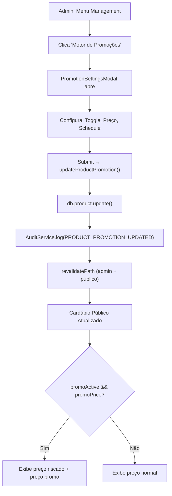

# 04 — Motor de Promoções

> **Ficheiros-chave:** `prisma/schema.prisma` (campos `promo*` e `isFeatured` no Product) · `_actions/product/update-product-promotion/` (schema.ts, index.ts) · `(protected)/menu-management/_components/promotion-settings-modal.tsx` · `_data-access/menu/get-menu-data.ts`

Este capítulo documenta o motor de promoções do Kipo ERP: como preços promocionais são configurados, como o agendamento por dia/hora funciona, e como a interface do cardápio público renderiza as promoções.

---

## 1. Modelo de Dados

Os campos de promoção vivem diretamente no model `Product` do schema:

```prisma
model Product {
  // ... campos base
  promoPrice       Decimal?  @db.Decimal(10, 2)
  promoActive      Boolean   @default(false)
  promoSchedule    Json?     // { type, days, startTime, endTime }
  isFeatured       Boolean   @default(false)
}
```

| Campo | Tipo | Descrição |
|---|---|---|
| `promoPrice` | `Decimal(10,2)?` | Preço promocional. Se `null`, não há desconto. |
| `promoActive` | `Boolean` | Toggle global da promoção. Se `false`, o preço normal é usado independente do schedule. |
| `promoSchedule` | `Json?` | Regras de agendamento (ver secção 3). |
| `isFeatured` | `Boolean` | Se `true`, o produto aparece no carrossel "Destaques Imperdíveis" do cardápio público. |

### Por que no Product e não num model separado?

Decisão pragmática: cada produto tem **no máximo uma** promoção ativa por vez. Criar um model `Promotion` separado com FK para Product adicionaria complexidade sem benefício real para o caso de uso atual (promoção simples, não cupons).

---

## 2. Schema de Validação (Zod)

**Ficheiro:** `_actions/product/update-product-promotion/schema.ts`

```typescript
export const promotionScheduleSchema = z.object({
  type: z.enum(["always", "scheduled"]),
  days: z.array(z.number()).optional(),     // 0-6 (Domingo=0, Sábado=6)
  startTime: z.string().optional(),          // "HH:mm"
  endTime: z.string().optional(),            // "HH:mm"
});

export const updateProductPromotionSchema = z.object({
  productId: z.string(),
  promoActive: z.boolean(),
  promoPrice: z.number().nullable(),
  promoSchedule: promotionScheduleSchema.nullable(),
});
```

### Tipos Derivados

```typescript
export type UpdateProductPromotionSchema = z.infer<typeof updateProductPromotionSchema>;
export type PromotionSchedule = z.infer<typeof promotionScheduleSchema>;
```

---

## 3. Regras de Agendamento (`promoSchedule`)

O campo `promoSchedule` armazena um JSON com 2 modos de operação:

### Modo "Always" (Sempre Ativa)

```json
{
  "type": "always",
  "days": [0, 1, 2, 3, 4, 5, 6],
  "startTime": "00:00",
  "endTime": "23:59"
}
```

A promoção está ativa **24/7** enquanto `promoActive = true`.

### Modo "Scheduled" (Programada)

```json
{
  "type": "scheduled",
  "days": [5, 6],
  "startTime": "18:00",
  "endTime": "22:00"
}
```

A promoção só é ativa em **sexta e sábado** das **18h às 22h**.

### Mapeamento de Dias

| Valor | Dia |
|---|---|
| 0 | Domingo |
| 1 | Segunda |
| 2 | Terça |
| 3 | Quarta |
| 4 | Quinta |
| 5 | Sexta |
| 6 | Sábado |

> **Nota sobre avaliação:** Atualmente o agendamento é **armazenado** mas a lógica de avaliação em tempo real (verificar se o dia/hora atual está dentro do schedule) **não é aplicada server-side** na query do menu. Os dados de `promoSchedule` são enviados ao cliente no DTO, permitindo avaliação client-side futura. O `promoActive` é o toggle principal que controla a exibição.

---

## 4. Server Action: `updateProductPromotion`

**Ficheiro:** `_actions/product/update-product-promotion/index.ts` (45 linhas)

```typescript
export const updateProductPromotion = actionClient
  .schema(updateProductPromotionSchema)
  .action(async ({ parsedInput: { productId, promoActive, promoPrice, promoSchedule } }) => {
    const companyId = await getCurrentCompanyId();

    // 1. Update com filtro de tenant (segurança)
    const product = await db.product.update({
      where: { id: productId, companyId },
      data: { promoActive, promoPrice, promoSchedule: promoSchedule as any },
    });

    // 2. Audit log
    await AuditService.log({
      type: AuditEventType.PRODUCT_PROMOTION_UPDATED,
      companyId,
      entityType: "PRODUCT",
      entityId: productId,
      metadata: { productName: product.name, promoActive, promoPrice },
    });

    // 3. Revalidação de cache
    revalidatePath("/menu-management");
    revalidatePath("/[companySlug]", "layout");

    return { success: true };
  });
```

### Segurança

| Verificação | Mecanismo |
|---|---|
| Validação de input | Zod schema via `actionClient.schema()` |
| Autenticação | Implícita via `getCurrentCompanyId()` (redireciona se sem sessão) |
| Isolamento multi-tenant | `where: { id: productId, companyId }` — impede edição de produtos de outra empresa |
| Auditoria | `AuditService.log` com tipo `PRODUCT_PROMOTION_UPDATED` |

### Cache Invalidation

```typescript
revalidatePath("/menu-management");       // Painel admin
revalidatePath("/[companySlug]", "layout"); // Cardápio público (todos os slugs)
```

---

## 5. Interface Admin: `PromotionSettingsModal`

**Ficheiro:** `(protected)/menu-management/_components/promotion-settings-modal.tsx` (245 linhas)

Modal usado no painel de gestão de cardápio. Permite configurar:

### Formulário

| Campo | Componente | Descrição |
|---|---|---|
| `promoActive` | `Switch` | Toggle ativa/inativa. |
| `promoPrice` | `NumericFormat` (react-number-format) | Input monetário com máscara BR (R$ 1.000,00). Placeholder mostra o preço normal. |
| `promoSchedule.type` | `Tabs` ("Sempre" / "Programado") | Define o modo do agendamento. |
| `promoSchedule.days` | Array de `Button` toggle | 7 botões (Dom-Sáb). Click seleciona/deseleciona. |
| `promoSchedule.startTime` | `Input type="time"` | Hora de início da promoção. |
| `promoSchedule.endTime` | `Input type="time"` | Hora de fim da promoção. |

### Valores Default

Quando o produto nunca teve promoção configurada:

```typescript
defaultValues: {
  productId: product.id,
  promoActive: product.promoActive || false,
  promoPrice: product.promoPrice ? Number(product.promoPrice) : null,
  promoSchedule: currentSchedule || {
    type: "always",
    days: [0, 1, 2, 3, 4, 5, 6],
    startTime: "00:00",
    endTime: "23:59"
  },
}
```

### Integração

```typescript
const { execute, isPending } = useAction(updateProductPromotion, {
  onSuccess: () => {
    toast.success("Configurações de promoção atualizadas!");
    onOpenChange(false);
  },
  onError: () => toast.error("Erro ao salvar promoção."),
});
```

---

## 6. Renderização no Cardápio Público

### Query do Menu

**Ficheiro:** `_data-access/menu/get-menu-data.ts` → `fetchMenuDetails()`

Os campos `promoActive`, `promoPrice`, `promoSchedule` e `isFeatured` são incluídos no `select` e mapeados para `MenuProductDto`:

```typescript
{
  promoActive: p.promoActive,
  promoPrice: p.promoPrice ? Number(p.promoPrice) : null,
  promoSchedule: p.promoSchedule,
  isFeatured: p.isFeatured,
}
```

### Exibição de Preço Riscado

**Ficheiro:** `menu-client.tsx` (L293-300) — No carrossel de highlights:

```jsx
{product.promoPrice ? (
  <>
    <p className="text-sm font-black text-primary">
      {formatPrice(product.promoPrice)}      {/* Preço promocional */}
    </p>
    <p className="text-[10px] font-bold text-gray-400 line-through">
      {formatPrice(product.price)}            {/* Preço original riscado */}
    </p>
  </>
) : (
  <p className="text-sm font-black text-primary">
    {formatPrice(product.price)}              {/* Preço normal */}
  </p>
)}
```

### `isFeatured` — Carrossel de Destaques

Produtos com `isFeatured: true` são filtrados e exibidos num carrossel horizontal no topo do menu:

```typescript
const highlights = menuData.categories
  .flatMap(c => c.products)
  .filter(p => p.isFeatured)
  .slice(0, 8);  // Máximo 8 destaques
```

---

## 7. Painel Admin: Menu Management

A gestão de promoções e visibilidade do menu é feita em:

**Rota:** `/menu-management`

**Data-access:** `_data-access/menu/get-menu-management-data.ts`

Cada produto no painel admin exibe:
- Toggle de visibilidade no cardápio (`isVisibleOnMenu`)
- Toggle de destaque (`isFeatured`)
- Badge de promoção (se `promoActive`)
- Botão "Motor de Promoções" → abre `PromotionSettingsModal`

---

## 8. Diagrama de Fluxo



---

## 9. Evolução Futura (Gaps Identificados)

| Item | Status | Descrição |
|---|---|---|
| Avaliação de `promoSchedule` server-side | ⚠️ Pendente | O schedule é armazenado mas não avaliado em tempo real na query. A flag `promoActive` é o controle efetivo. |
| Página `/promotions` no cardápio público | ⚠️ Pendente | O `BottomNav` tem o link mas a página não existe. |
| Cupons de desconto | 🔲 Não implementado | Modelo `Coupon` com código, percentual, validade e limite de uso. |
| Promoções combinadas (Combo) | 🔲 Não implementado | Preço especial para combinação de produtos. |
