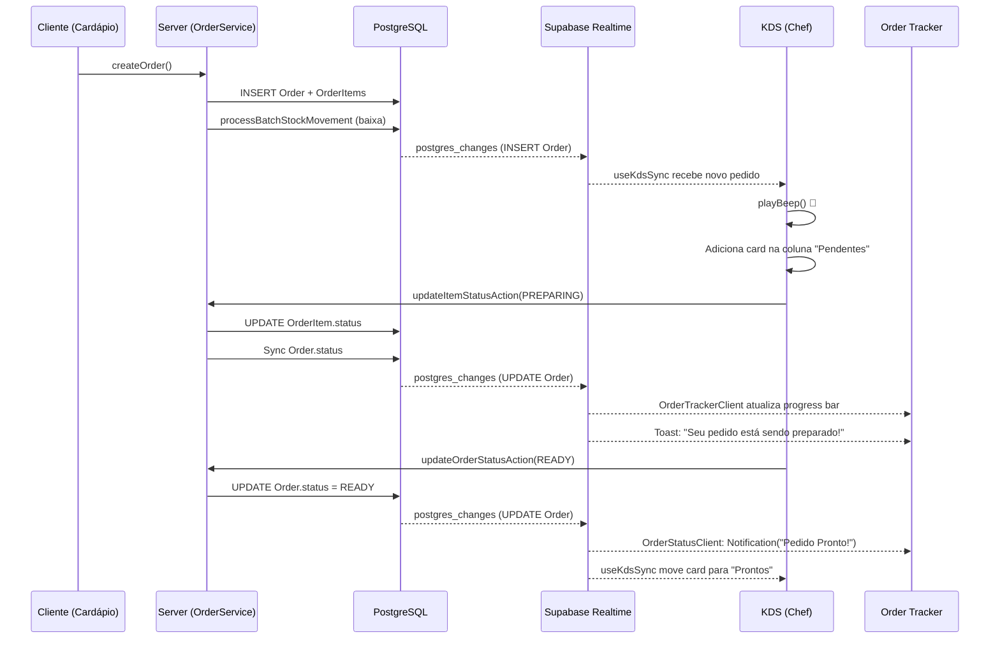

# 05 — KDS & Realtime

> **Ficheiros-chave:** `_hooks/use-kds-sync.ts` · `_hooks/use-kds-actions.ts` · `_hooks/kds-engine.ts` · `_components/kds-client.tsx` · `_data-access/order/get-kds-orders.ts` · `_lib/supabase.ts` · Order Tracker (`order-tracker-client.tsx`, `order-status-client.tsx`, `my-orders-client.tsx`)

Este capítulo documenta o sistema de Kitchen Display System (KDS) e toda a camada de comunicação em tempo real do Kipo ERP, baseada em Supabase Realtime Channels.

---

## 1. Arquitetura Geral

O KDS é um painel de cozinha que recebe pedidos em tempo real e permite ao chef avançar cada item pela pipeline de status. O sistema funciona em duas camadas:

```
Camada Server (RSC)                    Camada Client (Realtime)
┌─────────────────────┐               ┌──────────────────────────┐
│ KDSPage (page.tsx)  │               │ KDSClient                │
│  ↓                  │               │  ├── useKdsSync (estado)  │
│ getKDSOrders()      │──SSR──────→   │  ├── useKdsActions (mut.) │
│ getEnvironments()   │               │  └── kds-engine (lógica)  │
└─────────────────────┘               └──────────┬───────────────┘
                                                  │
                                      Supabase Realtime Channel
                                      ┌──────────┴───────────────┐
                                      │ postgres_changes         │
                                      │  • table: Order          │
                                      │  • table: OrderItem      │
                                      └──────────────────────────┘
```

**Fluxo:**
1. O **Server Component** (`kds/page.tsx`) faz a query inicial via `getKDSOrders()` e injeta os dados como `initialOrders`.
2. O **Client Component** (`KDSClient`) recebe os dados, ativa o canal Supabase e sincroniza em tempo real.
3. Ações do chef (avançar status) são processadas com **optimistic updates** + chamada à Server Action.

---

## 2. Modelos Envolvidos

### `Order`

| Campo | Tipo | Relevância KDS |
|---|---|---|
| `id` | `String (cuid)` | Identificador único do pedido. |
| `orderNumber` | `Int (autoincrement)` | Número sequencial exibido no card do KDS. |
| `status` | `OrderStatus` | Estado global do pedido (`PENDING → PAID`). |
| `tableNumber` | `String?` | Mesa do cliente, exibida no card. |
| `notes` | `String? (Text)` | Observações gerais (alergias, preferências). |
| `companyId` | `String` | Filtro multi-tenant no canal Realtime. |

### `OrderItem`

| Campo | Tipo | Relevância KDS |
|---|---|---|
| `id` | `String (cuid)` | Identificador único do item. |
| `status` | `OrderStatus` | Status **granular por item** — permite que itens de praças diferentes avancem independentemente. |
| `quantity` | `Decimal(10,3)` | Quantidade pedida. |
| `notes` | `String? (Text)` | Observações específicas do item ("sem cebola"). |
| `productId` | `String` | FK para `Product` — resolve nome e `environmentId`. |

### `Environment` (Praça/Estação)

| Campo | Tipo | Descrição |
|---|---|---|
| `id` | `String (cuid)` | Identificador da praça. |
| `name` | `String` | Nome da estação (ex: "Cozinha", "Grill", "Bar"). |
| `orderIndex` | `Int` | Ordem de exibição nas tabs do KDS. |

> **Por que `Environment`?** Um restaurante pode ter múltiplas estações de produção. Cada produto é vinculado a um `environmentId`. O KDS filtra itens por praça, permitindo que o chef do "Grill" veja apenas os itens da sua estação.

---

## 3. Ciclo de Vida do Pedido (OrderStatus)

```
PENDING ──→ PREPARING ──→ READY ──→ DELIVERED ──→ PAID
                                         ↘ CANCELED
```

| Status | Significado | Quem muda |
|---|---|---|
| `PENDING` | Pedido recebido, aguardando início | Automático (criação) |
| `PREPARING` | Chef iniciou a preparação | Chef no KDS |
| `READY` | Pedido pronto para servir | Chef no KDS |
| `DELIVERED` | Entregue na mesa | Chef/Garçom |
| `PAID` | Pagamento confirmado (convertido em `Sale`) | PDV (`OrderService.convertToSale`) |
| `CANCELED` | Cancelado (estoque estornado) | Admin (`OrderService.updateStatus`) |

### Status por Item vs. Status do Pedido

O Kipo usa um sistema de **status granular**: cada `OrderItem` tem seu próprio `status`. O `status` do `Order` é **derivado** dos itens:

```
Se TODOS os itens estão READY/DELIVERED/PAID → Pedido = READY
Se ALGUM item está PREPARING → Pedido = PREPARING
Se NENHUM item saiu de PENDING → Pedido = PENDING
```

Esta lógica está implementada em `OrderService.updateOrderItemStatus` (`_services/order.ts`) e no `kds-engine.ts`.

---

## 4. Camada de Dados (`get-kds-orders.ts`)

**Ficheiro:** `_data-access/order/get-kds-orders.ts`

### DTO

```typescript
interface KDSOrderDto {
  id: string;
  orderNumber: number;
  status: OrderStatus;
  tableNumber: string | null;
  notes: string | null;
  createdAt: Date;
  items: {
    id: string;
    productName: string;
    quantity: number;
    notes: string | null;
    environmentId: string | null;
    environmentName: string;     // Resolvido via join
    status: OrderStatus;         // Status granular do item
  }[];
}
```

### Query

A query filtra pedidos visíveis no KDS:

```
WHERE companyId = X
AND (
  status IN (PENDING, PREPARING, READY)         -- Sempre visíveis
  OR
  (status IN (DELIVERED, PAID) AND createdAt >= hoje 00:00)  -- Finalizados do dia
)
ORDER BY createdAt ASC  -- FIFO: primeiro a chegar, primeiro a aparecer
```

> **Por que manter DELIVERED/PAID do dia?** Para que o chef veja o histórico da coluna "Finalizados" durante o turno, sem poluir com pedidos de dias anteriores.

---

## 5. Supabase Realtime — Configuração

### Cliente

**Ficheiro:** `_lib/supabase.ts`

```typescript
import { createClient } from "@supabase/supabase-js";

const supabaseUrl = process.env.NEXT_PUBLIC_SUPABASE_URL!;
const supabaseAnonKey = process.env.NEXT_PUBLIC_SUPABASE_PUBLISHABLE_KEY!;

export const supabase = createClient(supabaseUrl, supabaseAnonKey);
```

Cliente singleton, importado por todos os componentes que precisam de Realtime. Usa a **anon key** (segura para client-side, RLS aplica-se automaticamente).

### Canais Ativos no Sistema

| Canal | Tabelas | Eventos | Componente | Filtro |
|---|---|---|---|---|
| `kds-realtime` | `Order`, `OrderItem` | `INSERT`, `UPDATE`, `DELETE` | `useKdsSync` | `companyId=eq.{X}` (na tabela Order) |
| `order-tracker-{orderId}` | `Order` | `UPDATE` | `OrderTrackerClient` | `id=eq.{orderId}` |
| `order-status-{orderId}` | `Order` | `UPDATE` | `OrderStatusClient` | `id=eq.{orderId}` |
| `customer-order-updates` | `Order`, `OrderItem` | `*` | `MyOrdersClient` | Nenhum (filtra no client) |

---

## 6. Hook: `useKdsSync` — Sincronização de Estado

**Ficheiro:** `kds/_hooks/use-kds-sync.ts`

Responsável por manter o estado dos pedidos sincronizado com o banco via Supabase Channels.

### Lógica por Evento

| Evento | Tabela | Comportamento |
|---|---|---|
| `INSERT` | `Order` | 🔔 Toca beep sonoro (`playBeep()`) + busca dados completos via `supabase.from("Order").select(...)` + adiciona ao topo da lista. |
| `UPDATE` | `Order` | Atualiza o pedido no estado local. **Ignora** se o `orderId` está em `pendingUpdates` (proteção contra eco do optimistic update). |
| `DELETE` | `Order` | Remove o pedido do estado local. |
| `UPDATE` | `OrderItem` | Atualiza o item dentro do pedido correto. Também ignora se há pending update. |

### `pendingUpdates` — Anti-Echo

```typescript
const pendingUpdates = useRef<Set<string>>(new Set());
```

Quando o chef clica "Iniciar" num pedido:
1. O `useKdsActions` adiciona o `orderId` a `pendingUpdates`.
2. A Server Action é chamada (update no banco).
3. O Supabase Realtime dispara um `UPDATE` de volta.
4. O `useKdsSync` verifica: "Este ID está em `pendingUpdates`?" → **Ignora** o evento para evitar sobreescrever o optimistic update.
5. Após 10 segundos, o ID é removido de `pendingUpdates`.

### Beep Sonoro (Novo Pedido)

```typescript
const playBeep = () => {
  const ctx = new AudioContext();
  const osc = ctx.createOscillator();
  osc.type = "sine";
  osc.frequency.setValueAtTime(880, ctx.currentTime); // Nota A5
  // Fade in → fade out em 200ms
};
```

Usa a Web Audio API (sem ficheiros de som externos). Frequência: 880Hz (Lá 5), duração: 200ms.

---

## 7. Hook: `useKdsActions` — Mutations com Optimistic Update

**Ficheiro:** `kds/_hooks/use-kds-actions.ts`

### `handleStatusUpdate(orderId, status)` — Ação de Pedido

1. Verifica se já está a processar (`isUpdatingIds`).
2. Filtra itens pela praça ativa (`activeEnvId`).
3. **Optimistic update:** Atualiza imediatamente o estado local.
4. Se `activeEnvId === "all"` → chama `updateOrderStatusAction` (atualiza o pedido inteiro).
5. Para todos os itens filtrados → chama `updateItemStatusAction` em paralelo (`Promise.all`).
6. Em caso de erro → exibe toast de erro (o estado será corrigido pelo próximo evento Realtime).
7. Remove de `pendingUpdates` após 10 segundos (timeout de segurança).

### `handleItemStatusUpdate(itemId, status)` — Ação Granular por Item

Mesma lógica, mas atualiza apenas **um item** específico. Usado quando o chef clica no badge de status de um item individual.

---

## 8. Motor de Derivação de Status (`kds-engine.ts`)

**Ficheiro:** `kds/_hooks/kds-engine.ts`

### `getDerivedStatus(order, activeEnvId)` — Status Derivado

Quando o KDS está filtrado por praça, o status exibido no card **não é** `order.status` do banco. É **derivado** dos itens visíveis:

| Contexto | Lógica |
|---|---|
| `activeEnvId === "all"` (Expedição) | Todos os itens READY/DELIVERED/PAID → `READY`. Algum PREPARING → `PREPARING`. Todos PENDING → `PENDING`. Se order.status é DELIVERED/PAID e itens todos prontos → mantém o status original. |
| `activeEnvId === "xyz"` (Praça específica) | Mesma lógica, mas filtrada apenas aos itens da praça. |

### `getStationSummary(order)` — Resumo por Praça

Retorna um array de `StationSummary` para o card na visão "Expedição":

```typescript
interface StationSummary {
  name: string;      // "Cozinha", "Grill"
  count: string;     // "2/3" (2 de 3 itens prontos)
  isDone: boolean;   // true se todos os itens da praça estão prontos
}
```

### `getPreviousStatus(status)` — Botão "Desfazer"

```
PREPARING → PENDING
READY     → PREPARING
DELIVERED → READY
PAID      → READY
```

### `isUrgent(createdAt, now, slaMinutes)` — SLA

Retorna `true` se o pedido ultrapassou 30 minutos (default). Usado para colorir o card em vermelho.

---

## 9. Componentes Visuais

### `KDSClient` — Orquestrador

**Ficheiro:** `kds/_components/kds-client.tsx` (317 linhas)

| Responsabilidade | Mecanismo |
|---|---|
| Filtro por praça | Query param `?station={envId}` (URL-driven) |
| Colunas Kanban | Array fixo: Pendentes → Preparando → Prontos → Finalizados |
| Detalhe do pedido | `Sheet` lateral ao clicar num card |
| Indicador Realtime | Badge "REALTIME ATIVO" com pulsação verde |

**Colunas do Kanban:**

| Coluna | Status Filtrado | Ação do Botão | Próximo Status |
|---|---|---|---|
| Pendentes | `PENDING` | "Iniciar" | `PREPARING` |
| Preparando | `PREPARING` | "Pronto" | `READY` |
| Prontos | `READY` | "Entregar" | `DELIVERED` |
| Finalizados | `DELIVERED`, `PAID` | — | — |

### `KDSColumn` — Coluna Individual

**Ficheiro:** `kds/_components/kds-column.tsx`

Renderiza a lista vertical de cards para um status. Recebe callbacks para ação principal, ação por item, undo e detalhe.

### `KDSCard` — Card de Pedido

**Ficheiro:** `kds/_components/kds-card.tsx` (maior componente, ~300 linhas)

Exibe: número do pedido, mesa, tempo decorrido, lista de itens com badges de status por praça, botão de ação principal, botão de desfazer.

---

## 10. Order Tracker (Visão do Cliente)

O sistema oferece **3 interfaces públicas** para o cliente acompanhar seu pedido, todas com Realtime:

### `OrderTrackerClient`

**Rota:** `/[companySlug]/order/[orderId]`
**Canal:** `order-tracker-{orderId}` → tabela `Order`, evento `UPDATE`

- Progress bar visual com 4 estágios (Recebido → Preparando → Pronto → Entregue).
- Toasts contextuais por status (ex: "Seu pedido está sendo preparado! 👨‍🍳").
- Detalhes do pedido: itens, quantidades, total, mesa.

### `OrderStatusClient`

**Rota:** `/[companySlug]/order/[orderId]` (variante alternativa)
**Canal:** `order-status-{orderId}` → tabela `Order`, evento `UPDATE`

- Timeline em 5 passos com stepper visual.
- **Push notifications nativas**: Pede permissão ao browser e envia `new Notification("Pedido Pronto!")` quando o status muda para `READY`.
- Botão de opt-in para notificações com estados: default, granted, denied.

### `MyOrdersClient`

**Rota:** `/[companySlug]/my-orders`
**Canal:** `customer-order-updates` → tabelas `Order` + `OrderItem`, todos os eventos

- Carrega pedidos via `getMyOrdersAction` usando `customerId` do `localStorage`.
- Atualiza status de pedidos e itens em tempo real.
- Remove pedidos cujos itens foram todos deletados (pagamento parcial por item).

---

## 11. Diagrama de Fluxo Completo



---

## 12. Testes Existentes

| Ficheiro | Escopo |
|---|---|
| `tests/unit/kds-engine.test.ts` | Testes puros das funções `getDerivedStatus`, `getStationSummary`, `getPreviousStatus`, `isUrgent` |

> **Gap identificado:** Não existem testes de integração para o fluxo completo `createOrder → Realtime → KDS update`. Isso é mitigado pelo facto de o Supabase Realtime ser uma camada de infraestrutura que não depende do código da aplicação para funcionar — o trigger é nativo do PostgreSQL.

---

## 13. Resolução de Problemas Comuns

### Pedidos não atualizam em tempo real (mas aparecem ao dar F5)

**Causa provável:** Falta de `REPLICA IDENTITY FULL` no PostgreSQL.
O Supabase Realtime usa filtros (ex: `filter: companyId=eq.X`). Por padrão, o Postgres envia apenas as colunas alteradas e a Chave Primária. Se o `companyId` não foi a coluna alterada, o Supabase não consegue aplicar o filtro e descarta o evento.

**Solução:**
```sql
ALTER TABLE "Order" REPLICA IDENTITY FULL;
ALTER TABLE "OrderItem" REPLICA IDENTITY FULL;
```

### Erro `CHANNEL_ERROR` ou subscrição falha

**Causa provável:** As tabelas não estão na publicação do Supabase.
**Solução:**
```sql
ALTER PUBLICATION supabase_realtime ADD TABLE "Order";
ALTER PUBLICATION supabase_realtime ADD TABLE "OrderItem";
```

### Erro `useAppMode must be used within AppModeProvider`

**Contexto:** Ocorre quando componentes que dependem do contexto de modo do app (Gestão vs Operação) são renderizados em rotas públicas (como o rastreador de pedidos).
**Solução aplicada:** O hook `useAppMode` foi modificado para retornar um estado padrão (`gestao`) caso o provider não seja encontrado, evitando o crash da aplicação.
