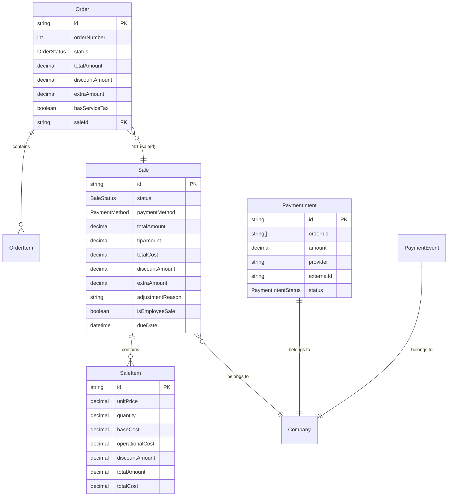
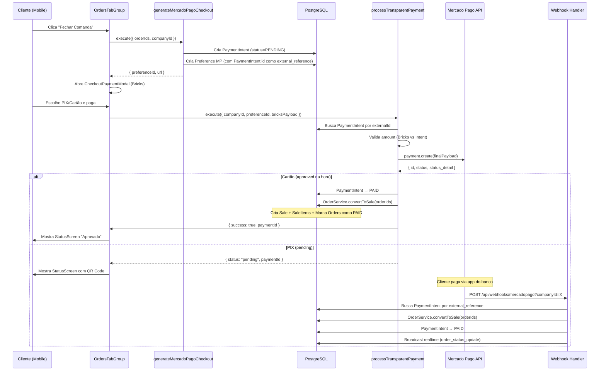

# Relatório de Fluxo Financeiro Atual — Kipo

> **Autor:** Antigravity (Arquiteto Fintech)
> **Data:** 2026-07-13
> **Objetivo:** Mapear com absoluta precisão como o dinheiro flui no sistema Kipo hoje, para que a implementação do Split/Take Rate não crie redundâncias nem quebre cálculos existentes.

---

## 1. Modelagem de Banco de Dados (schema.prisma)

### 1.1 Tabelas Centrais do Fluxo Financeiro



### 1.2 Anatomia de uma Venda

| Campo | Tabela | Propósito |
|---|---|---|
| `totalAmount` | `Sale` | **Valor bruto** (subtotal + gorjeta − desconto + extra). É o que o cliente pagou. |
| `totalCost` | `Sale` | **Custo total** (soma dos custos dos itens). Usado para calcular lucro. |
| `tipAmount` | `Sale` | **Gorjeta** (taxa de serviço de 10%). Separada do faturamento de produtos. |
| `discountAmount` | `Sale` | Valor em R$ de desconto aplicado. |
| `extraAmount` | `Sale` | Valor em R$ de acréscimo (ex: taxa de entrega). |
| `paymentMethod` | `Sale` | Enum: `CASH`, `PIX`, `CREDIT_CARD`, `DEBIT_CARD`, `OTHER`. |
| `isEmployeeSale` | `Sale` | Flag: venda a preço de custo para funcionário. |
| `unitPrice` | `SaleItem` | **Snapshot** do preço no momento da venda. |
| `baseCost` | `SaleItem` | **Snapshot** do custo base do produto no momento da venda. |
| `operationalCost` | `SaleItem` | **Snapshot** do custo operacional no momento da venda. |

### 1.3 Colunas Relevantes já Existentes para o Split

| Campo | Tabela | Propósito |
|---|---|---|
| `kipoMarketplaceFeeRate` | `Company` | `Decimal(5,4)` — Ex: `0.0150` = 1.5%. **Já existe no schema, pronta para uso.** |
| `mpMarketplaceToken` | `Company` | Access Token do lojista via OAuth Marketplace. |
| `mpMarketplaceAccountId` | `Company` | User ID do lojista no MP. |
| `mpCheckoutEnabled` | `Company` | Flag de integração ativa. |

### 1.4 Colunas que NÃO EXISTEM (Gap para o Split)

| Campo Faltante | Tabela Ideal | Propósito |
|---|---|---|
| `platformFeeAmount` | `Sale` | Valor em R$ da taxa Kipo nesta transação (foto imutável). |
| `platformFeeRate` | `Sale` | Taxa % aplicada (foto imutável, pois `Company.kipoMarketplaceFeeRate` pode mudar). |
| `netAmount` | `Sale` | `totalAmount − platformFeeAmount` = valor líquido que o lojista recebeu. |
| `paymentProvider` | `Sale` | Qual gateway processou (`MERCADOPAGO`, `CASH`, etc.). |
| `externalPaymentId` | `Sale` | ID do pagamento no gateway (para conciliação/estorno). |

---

## 2. O Ciclo de Vida do Checkout (Fluxo Passo a Passo)

### 2.1 Fluxo "Comanda Ativa" → Checkout Transparente (Bricks)



### 2.2 Fluxo "Pagar Depois" (SETTLED_LATER)

1. O **operador** no PDV fecha a comanda com status `SETTLED_LATER` (Fiado).
2. A `Sale` é criada com `status = PENDING_PAYMENT` e uma `dueDate`.
3. As `Order`s ficam com status `SETTLED_LATER`.
4. Na tela pública `/my-orders`, aba "A Pagar", o cliente vê o botão "Pagar Agora".
5. O clique dispara `generateMercadoPagoCheckout` com `saleId` (em vez de `orderIds`).
6. O `external_reference` aponta para o `PaymentIntent.id`.
7. Após pagamento, o webhook atualiza a `Sale` para `ACTIVE` e as `Order`s para `PAID`.

### 2.3 Fluxo QR Code (PDV do Operador)

1. O operador no PDV clica para gerar Pix.
2. Dispara `generatePixPayment` → Cria `PaymentIntent` → `gateway.generateDynamicPix()`.
3. Retorna QR Code Base64 + Copia e Cola.
4. Webhook confirma e converte para `Sale` via `convertToSale`.

### 2.4 Onde o Webhook Atualiza o Status

| Arquivo | Responsabilidade |
|---|---|
| [`route.ts`](file:///c:/Projetos/stock-manager/app/api/webhooks/mercadopago/route.ts) | Router: roteia por `companyId` (tenant) ou ausência dele (sistema Kipo). |
| [`tenant-payment.handler.ts`](file:///c:/Projetos/stock-manager/app/api/webhooks/mercadopago/_handlers/tenant-payment.handler.ts) | Processa pagamentos de comandas do restaurante. |
| [`system-subscription.handler.ts`](file:///c:/Projetos/stock-manager/app/api/webhooks/mercadopago/_handlers/system-subscription.handler.ts) | Processa pagamentos de assinatura Kipo Pro. |

---

## 3. Dashboard e Relatórios — Como os Dados São Lidos

### 3.1 Dashboard Principal ([`get-dashboard-analytics.ts`](file:///c:/Projetos/stock-manager/app/_data-access/dashboard/get-dashboard-analytics.ts))

Utiliza o serviço [`analytics.ts`](file:///c:/Projetos/stock-manager/app/_services/analytics.ts) que faz **Raw SQL** diretamente:

```sql
-- Faturamento (Revenue)
SELECT SUM(si."unitPrice" * si."quantity") as revenue,
       SUM((si."baseCost" + si."operationalCost") * si."quantity") as cost,
       (SELECT SUM("tipAmount") FROM "Sale" WHERE ...) as tips
FROM "SaleProduct" si
JOIN "Sale" s ON s.id = si."saleId"
WHERE s."companyId" = $1 AND s."status" = 'ACTIVE'
  AND s."date" >= $2 AND s."date" < $3
```

**Campos somados:**
| Métrica | Cálculo |
|---|---|
| **Faturamento** | `SUM(SaleItem.unitPrice × SaleItem.quantity)` |
| **COGS (Custo)** | `SUM((SaleItem.baseCost + SaleItem.operationalCost) × SaleItem.quantity)` |
| **Lucro Bruto** | `Revenue − COGS` |
| **Margem** | `(Profit / Revenue) × 100` |
| **Gorjetas** | `SUM(Sale.tipAmount)` — calculada separadamente na query |
| **Ticket Médio** | `Revenue / COUNT(Sales)` |

> [!IMPORTANT]
> O Dashboard **não lê** `Sale.totalAmount` para faturamento. Ele recalcula via SaleItems.
> Isso significa que `Sale.totalAmount` é informacional, e **não a fonte da verdade** nos relatórios.
> A gorjeta também **não está incluída** no faturamento dos produtos (corretamente separada).

### 3.2 Relatório Excel ([`export.ts`](file:///c:/Projetos/stock-manager/app/_services/export.ts))

Usa o **mesmo padrão**: soma `SaleItem.unitPrice × quantity` para faturamento.
Gorjetas são somadas separadamente via `Sale.tipAmount`.

### 3.3 Impacto do Split nos Relatórios

Se adicionarmos `platformFeeAmount` na `Sale`:
- O **dashboard do restaurante** deve continuar exibindo o `Revenue` bruto (o que o cliente pagou).
- Precisamos criar um **card novo** ou **linha no relatório** mostrando: `Revenue − platformFeeAmount = Receita Líquida`.
- O **dashboard administrativo do Kipo** (admin) deve somar `platformFeeAmount` de todas as empresas para ver a receita da plataforma.

---

## 4. Auditoria e Rastreabilidade

### 4.1 Tabela `AuditEvent`

```
AuditEvent {
  id, type, companyId, actorId, customerId,
  metadata (JSON), entityId, entityType,
  severity (INFO|WARNING|CRITICAL),
  createdAt
}
```

**Tipos relevantes ao fluxo financeiro:**
| Tipo | Quando é gravado |
|---|---|
| `SALE_CREATED` | Webhook converte orders em Sale (pagamento aprovado). |
| `SALE_UPDATED` | Webhook atualiza Sale existente (ex: SETTLED_LATER → ACTIVE). |
| `SALE_CANCELED` | Operador cancela venda via [`cancel-sale`](file:///c:/Projetos/stock-manager/app/_actions/sale/cancel-sale/index.ts). |
| `ORDER_CREATED` | Novo pedido criado pelo cliente. |
| `SUBSCRIPTION_ACTIVATED` | Pagamento de assinatura Kipo Pro. |

### 4.2 Tabela `PaymentEvent` (Idempotência de Webhooks)

```
PaymentEvent {
  id (= MP payment ID),
  companyId, provider, eventType,
  status ("processed"|"failed"),
  payload (JSON — raw body do webhook),
  processedAt
}
```

Garante que um mesmo webhook do MP não seja processado duas vezes.

### 4.3 Tabela `StockMovement`

Toda venda/cancelamento gera movimentações de estoque rastreáveis:
- `type: ORDER` → Dedução no momento do pedido.
- `type: CANCEL` → Devolução ao estoque.
- `type: SALE` → Vinculação à Sale (após conversão).

### 4.4 Gaps de Auditoria

| Gap | Impacto |
|---|---|
| **Sem registro de estorno/refund** | Se um pagamento online for cancelado, o `cancel-sale` só atualiza o banco local. Não há chamada `refund` para a API do MP. |
| **Sem log de quem alterou a taxa** | Se `kipoMarketplaceFeeRate` mudar na Company, não há AuditEvent registrando a mudança. |
| **Sem conciliação automática** | Não existe job que compare os pagamentos no MP com os registros no banco para detectar divergências. |

---

## 5. Diagnóstico para o Split — O que Precisamos Adicionar

### 5.1 Na Camada de Banco (schema.prisma)

```prisma
model Sale {
  // ... campos existentes ...

  // ── Split / Take Rate ──
  platformFeeRate    Decimal?  @db.Decimal(5, 4)  // Snapshot da taxa no momento (ex: 0.0150 = 1.5%)
  platformFeeAmount  Decimal?  @db.Decimal(10, 2)  // Valor em R$ da taxa Kipo
  netAmount          Decimal?  @db.Decimal(10, 2)  // totalAmount - platformFeeAmount
  paymentProvider    String?                        // "MERCADOPAGO", "CASH", etc.
  externalPaymentId  String?                        // ID do pagamento no gateway
}
```

> [!IMPORTANT]
> **Por que `platformFeeRate` na Sale se já existe `kipoMarketplaceFeeRate` na Company?**
> Porque a taxa na Company é mutável. Se amanhã o Kipo mudar de 1% para 2%, todas as vendas passadas recalculariam errado. O snapshot na Sale garante a "foto" imutável do momento da transação.

### 5.2 Na Camada de Actions (Backend)

| Arquivo | Mudança |
|---|---|
| `process-transparent-payment.ts` | Calcular `applicationFee = amount × feeRate` e enviar no payload MP como `application_fee`. Gravar snapshot na Sale. |
| `generate-mercadopago-checkout.ts` | Mesmo cálculo para o fluxo Checkout Pro. |
| `generate-pix-payment.ts` | Mesmo cálculo para o fluxo QR Code do PDV. |
| `tenant-payment.handler.ts` | Ao criar a Sale via webhook, gravar `platformFeeRate`, `platformFeeAmount`, `netAmount`, `externalPaymentId`. |
| `cancel-sale/index.ts` | Implementar chamada de refund na API do MP e registrar no AuditEvent. |

### 5.3 Na Camada de Analytics/Dashboard

| Arquivo | Mudança |
|---|---|
| `analytics.ts` | Adicionar `platformFeeAmount` e `netAmount` às queries de overview. |
| `get-dashboard-analytics.ts` | Novo DTO: `platformFees` (total de taxas no período) e `netRevenue`. |
| `sales-summary.tsx` | Novo card: "Receita Líquida" (após taxas da plataforma). |
| `export.ts` | Novo KPI no resumo executivo: "Taxa Kipo" e "Receita Líquida". |

### 5.4 Resumo do Impacto

```
┌─────────────────────────────────────────────────────────────┐
│                   IMPACTO DA IMPLEMENTAÇÃO                   │
├─────────────────────────────────────────────────────────────┤
│ Migration SQL       : 1 (adicionar 5 colunas na Sale)       │
│ Arquivos Backend    : 5 (3 actions + 1 webhook + 1 service) │
│ Arquivos Frontend   : 3 (summary + dashboard + export)      │
│ Tabelas novas       : 0                                      │
│ Breaking changes    : 0 (todas colunas nullable/opcionais)  │
│ Risco de regressão  : Baixo (campos opcionais, queries Raw  │
│                       SQL existentes não serão afetadas)     │
└─────────────────────────────────────────────────────────────┘
```
