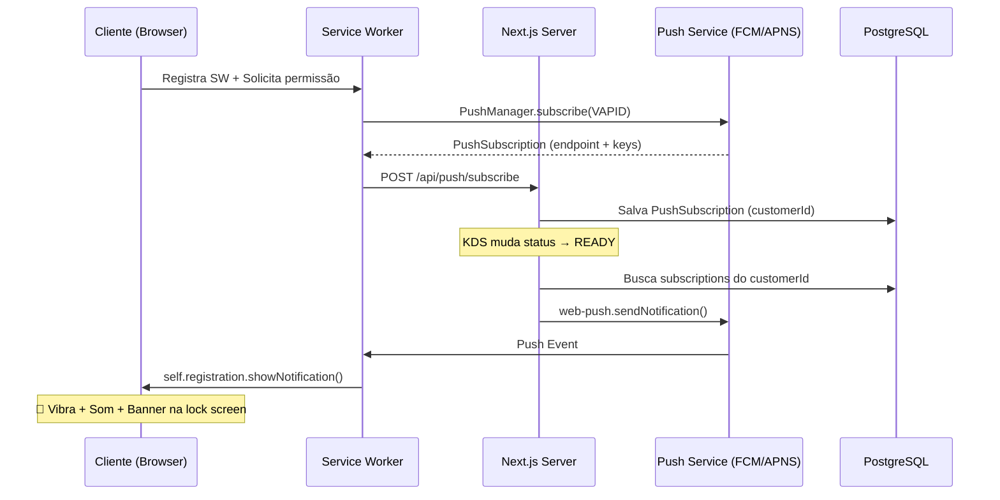

# Push Notifications — Notificar Cliente quando Pedido está PRONTO

## Contexto

A maioria dos clientes usa o cardápio pelo smartphone. Quando o pedido fica pronto (`READY`), o cliente precisa ser notificado **mesmo com a tela bloqueada**, com:
- **Push Notification nativa** (aparece na tela de bloqueio)
- **Vibração** do dispositivo
- **Sinal sonoro** de alerta

## Situação Atual

| O que já existe | Arquivo |
|---|---|
| Service Worker mínimo (apenas PWA install) | [sw.js](file:///c:/Projetos/stock-manager/public/sw.js) |
| Registro do SW no layout | [service-worker-register.tsx](file:///c:/Projetos/stock-manager/app/_components/pwa/service-worker-register.tsx) |
| Notification API local (apenas funciona com aba aberta) | [order-status-client.tsx](file:///c:/Projetos/stock-manager/app/(public)/[companySlug]/order/[orderId]/_components/order-status-client.tsx#L137-L143) |
| Supabase Realtime na tela "Meus Pedidos" | [my-orders-client.tsx](file:///c:/Projetos/stock-manager/app/(public)/[companySlug]/my-orders/_components/my-orders-client.tsx#L364-L398) |

> [!IMPORTANT]
> A implementação atual com `new Notification()` **só funciona com a aba aberta e em foco**. Para notificar com tela bloqueada, é necessário **Web Push API** via Service Worker + servidor push.

## Abordagem Escolhida: Web Push API

A **Web Push API** é a única forma de enviar notificações para o smartphone do cliente **mesmo com o navegador fechado ou tela bloqueada**. Funciona em:
- ✅ Chrome Android (95%+ dos clientes)
- ✅ Samsung Internet
- ✅ Firefox Android
- ✅ Edge Android
- ⚠️ Safari iOS 16.4+ (apenas PWA instalada na Home Screen)

### Fluxo Arquitetural



## User Review Required

> [!IMPORTANT]
> **VAPID Keys**: Precisaremos gerar um par de chaves VAPID (pública + privada) e adicionar ao `.env`. A chave pública é exposta ao cliente (`NEXT_PUBLIC_VAPID_PUBLIC_KEY`), e a privada fica apenas no servidor (`VAPID_PRIVATE_KEY`). Posso gerar automaticamente via `web-push generate-vapid-keys`.

> [!WARNING]
> **iOS Safari**: Push notifications em Safari iOS **só funcionam se o site for instalado como PWA** (adicionado à tela inicial). Isso já é parcialmente coberto pelo `PWAInstallBanner` existente, mas vale considerar melhorar o prompt de instalação PWA para maximizar adoção.

> [!IMPORTANT]
> **Banco de dados**: Um novo model `PushSubscription` será criado no Prisma para armazenar as subscriptions dos clientes. Cada dispositivo terá sua própria subscription. Um cliente pode ter múltiplos dispositivos.

## Proposed Changes

### 1. Banco de Dados — Nova tabela `PushSubscription`

#### [NEW] Migration Prisma

Adicionar model ao schema:

```prisma
model PushSubscription {
  id         String   @id @default(cuid())
  customerId String
  customer   Customer @relation(fields: [customerId], references: [id], onDelete: Cascade)
  companyId  String
  company    Company  @relation(fields: [companyId], references: [id], onDelete: Cascade)
  endpoint   String   @unique
  p256dh     String
  auth       String
  createdAt  DateTime @default(now())

  @@index([customerId, companyId])
}
```

#### [MODIFY] [schema.prisma](file:///c:/Projetos/stock-manager/prisma/schema.prisma)
- Adicionar o model `PushSubscription`
- Adicionar relação `pushSubscriptions` nos models `Customer` e `Company`

---

### 2. Service Worker — Receber Push Events

#### [MODIFY] [sw.js](file:///c:/Projetos/stock-manager/public/sw.js)
- Adicionar listener `push` para receber notificações do servidor
- Mostrar notification com `self.registration.showNotification()`
- Incluir vibração pattern e som
- Adicionar listener `notificationclick` para abrir a página de pedidos ao clicar

---

### 3. Backend — API de Push

#### [NEW] `app/api/push/subscribe/route.ts`
- Endpoint POST para salvar `PushSubscription` no banco
- Recebe: `{ subscription, customerId, companyId }`
- Valida e persiste no Prisma

#### [NEW] `app/api/push/unsubscribe/route.ts`
- Endpoint DELETE para remover subscription
- Recebe: `{ endpoint }`

#### [NEW] `app/_lib/push-notifications.ts`
- Função `sendPushToCustomer(customerId, companyId, payload)` usando `web-push`
- Busca todas subscriptions do customer, envia para cada uma
- Remove subscriptions inválidas automaticamente (410 Gone)

---

### 4. Integração no Fluxo de Pedido

#### [MODIFY] [update-order-flow/index.ts](file:///c:/Projetos/stock-manager/app/_actions/order/update-order-flow/index.ts)
- Quando `newOrderStatus === READY`, chamar `sendPushToCustomer()` para notificar o cliente
- Buscar `customerId` do pedido para enviar a push

---

### 5. Frontend — Solicitar Permissão e Registrar Subscription

#### [NEW] `app/_hooks/use-push-notifications.ts`
- Hook reutilizável que:
  - Verifica suporte a Push API
  - Solicita permissão
  - Faz `PushManager.subscribe()` com a VAPID key
  - Envia subscription para o backend via `POST /api/push/subscribe`

#### [MODIFY] [my-orders-client.tsx](file:///c:/Projetos/stock-manager/app/(public)/[companySlug]/my-orders/_components/my-orders-client.tsx)
- Usar o hook `usePushNotifications` quando o cliente estiver logado
- Adicionar botão "Ativar notificações" com UX premium
- Auto-request após login com delay elegante

#### [MODIFY] [order-status-client.tsx](file:///c:/Projetos/stock-manager/app/(public)/[companySlug]/order/[orderId]/_components/order-status-client.tsx)
- Substituir `new Notification()` local pelo hook `usePushNotifications`
- Manter o botão de opt-in existente, mas agora registrando push subscription

#### [MODIFY] [cart-checkout-sheet.tsx](file:///c:/Projetos/stock-manager/app/(public)/[companySlug]/_components/cart/cart-checkout-sheet.tsx)
- Após finalizar pedido com sucesso, solicitar permissão de push (primeiro pedido = melhor momento para opt-in)

---

### 6. Áudio de Notificação

#### [NEW] `public/sounds/order-ready.mp3`
- Som curto e agradável para a notificação (3-5 segundos)
- Usado pelo Service Worker no evento push

---

### 7. Variáveis de Ambiente

#### [MODIFY] [.env](file:///c:/Projetos/stock-manager/.env)
```env
NEXT_PUBLIC_VAPID_PUBLIC_KEY=<generated>
VAPID_PRIVATE_KEY=<generated>
```

---

## Resumo dos Arquivos

| Ação | Arquivo | Responsabilidade |
|------|---------|-----------------|
| MODIFY | `prisma/schema.prisma` | Novo model `PushSubscription` |
| MODIFY | `public/sw.js` | Push event listener + notification display |
| NEW | `app/api/push/subscribe/route.ts` | Salvar subscription no DB |
| NEW | `app/api/push/unsubscribe/route.ts` | Remover subscription |
| NEW | `app/_lib/push-notifications.ts` | Enviar push via `web-push` |
| NEW | `app/_hooks/use-push-notifications.ts` | Hook client-side para gerenciar push |
| MODIFY | `app/_actions/order/update-order-flow/index.ts` | Disparar push no status READY |
| MODIFY | `my-orders-client.tsx` | UX de opt-in para push |
| MODIFY | `order-status-client.tsx` | Migrar para push subscription |
| MODIFY | `cart-checkout-sheet.tsx` | Solicitar push após 1º pedido |
| NEW | `public/sounds/order-ready.mp3` | Arquivo de áudio da notificação |
| MODIFY | `.env` | VAPID keys |

## Verification Plan

### Automated Tests
```bash
node node_modules/typescript/bin/tsc --noEmit
```

### Manual Verification
1. Gerar VAPID keys e configurar `.env`
2. Executar `npx prisma db push` para criar a tabela
3. Fazer um pedido como cliente no smartphone
4. Aceitar a notificação push quando solicitado
5. Bloquear a tela do celular
6. No KDS, marcar o pedido como `READY`
7. Verificar que: vibrou + apareceu notificação na lock screen + som tocou
8. Clicar na notificação e verificar redirecionamento para "Meus Pedidos"
